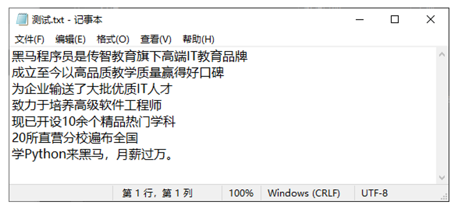

# 第一阶段 - 第八章：Python 文件操作

**目录：**

[TOC]

---

## 一、文件编码概念

### 1.1 文件编码

思考：计算机只能识别 0 和 1，那么我们丰富的文本文件是如何被计算机识别并存储在硬盘中呢？
* 答案：使用编码技术（密码本）将内容翻译成 0 和 1 存入。

编码技术即翻译的规则，记录了如何将内容翻译成二进制以及如何将二进制翻译回可识别内容。如下图所示：

编码就是一种规则集合，记录了内容和二进制间进行相互转换的逻辑。计算机中有许多可用编码，例如 UTF-8、GBK、Big5 等，其中我们最常用的是 UTF-8 编码。不同的编码，将内容翻译成二进制也是不同的。

> 为什么需要使用编码？
> * 计算机只认识 0 和 1，所以需要将内容翻译成 0 和 1 才能保存在计算机中；
> * 同时也需要编码，将计算机保存的 0 和 1，反向翻译回可以识别的内容。

编码有许多，所以要使用正确的编码，才能对文件进行正确的读写操作：

如上图所示，如果你给喜欢的女孩发送文件，使用编码 A 进行编码（内容转二进制），女孩使用编码 B 打开文件进行解码（二进制反转回内容），那只好自求多福了！

### 1.2 查看文件编码

我们可以使用 Windows 系统自带的记事本，打开文件后，即可看出文件的编码是什么：

UTF-8 是目前全球通用的编码格式。

除非有特殊需求，否则一律以 UTF-8 格式进行文件编码即可。