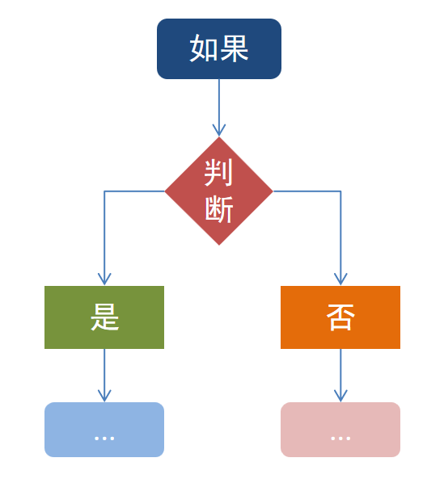
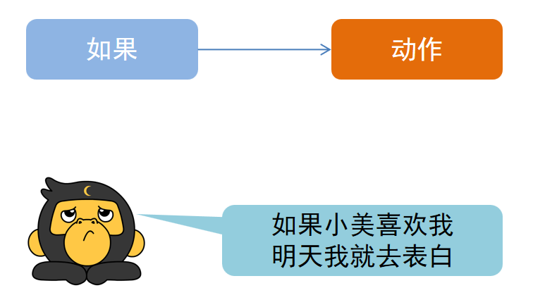
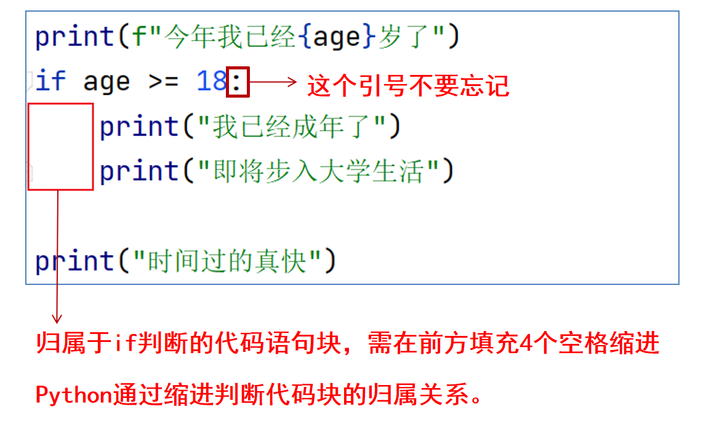
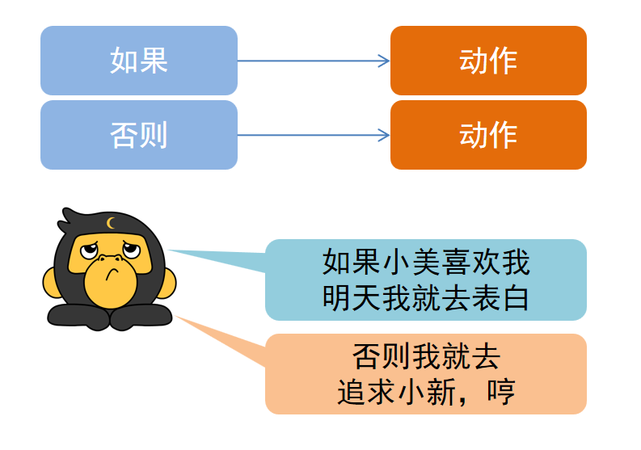
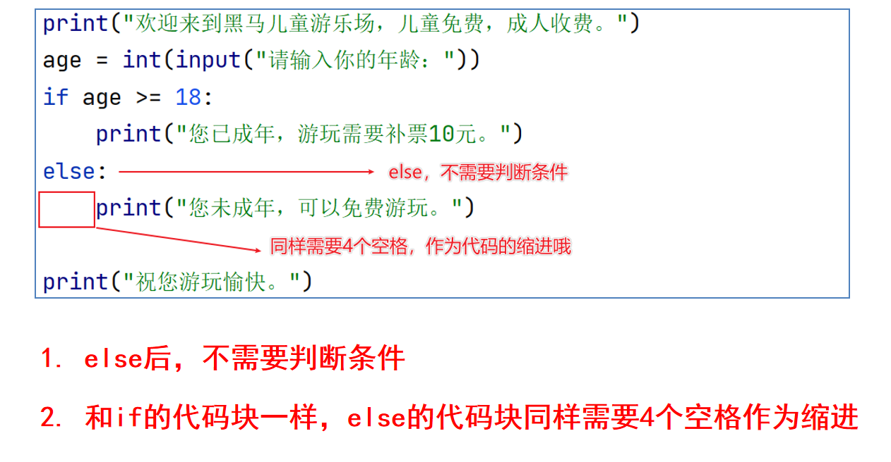
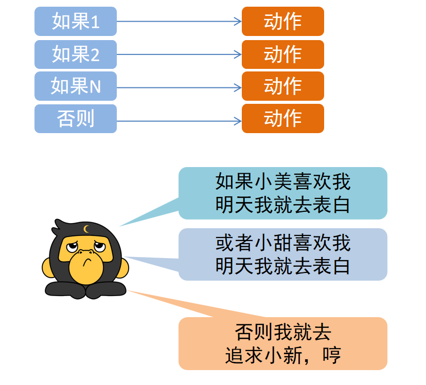
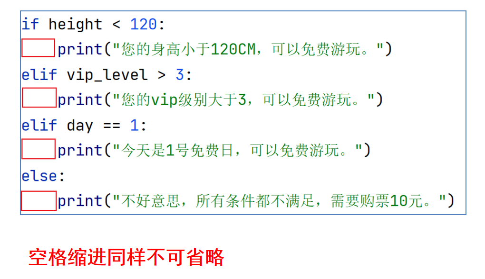
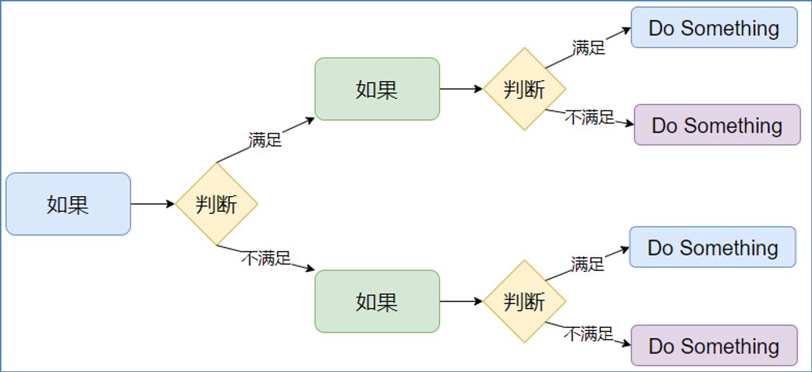

# 第一阶段 - 第三章

**目录：**

[TOC]

---

进行逻辑判断，是生活中常见的行为。同样，在程序中，进行逻辑判断也是最为基础的功能。



判断是程序最基础、最核心的逻辑功能。

## 一、布尔类型和比较运算符

进行判断，只有 2 个结果：
* 是；
* 否。


程序中使用布尔类型来描述是或否。

布尔（`bool`）表达现实生活中的逻辑，即真和假：
* `True` 表示真；
* `False` 表示假。

`True` 本质上是一个数字，记作 `1`；`False` 记作 `0`。

布尔类型的字面量：
* `True` 表示 真（是、肯定）；
* `False` 表示 假（否、否定）。

定义变量存储布尔类型数据：
```python
变量名称 = 布尔类型字面量
```

布尔类型不仅可以自行定义，同时也可以通过计算得来；也就是使用比较运算符进行比较运算得到布尔类型的结果。
示例代码 1：
```python
result = 10 > 5
print(f"10 > 5 的结果是：{result}，类型是：{type(result)}")
```
输出结果 1：
```python
10 > 5 的结果是：True，类型是：<class 'bool'>
```
示例代码 2：
```python
result = "itcast" == "itheima"
print(f"字符串 itcast 是否和 itheima 相等，结果是：{result}，类型是：{type(result)}")
```
输出结果 2：
```python
字符串 itcast 是否和 itheima 相等，结果是：False，类型是：<class 'bool'>
```

比较运算符：
| 运算符 | 描述 | 示例 |
| :--: | :--: | :--: |
| `==` | 判断内容是否相等，满足为 `True`，不满足为 `False` | 如 `a = 3`，`b = 3`，则 `(a == b)` 为 `True` |
| `!=` | 判断内容是否不相等，满足为 `True`，不满足为 `False` | 如 `a = 1，b = 3`，则 `(a != b)` 为 `True` |
| `>` | 判断运算符左侧内容是否大于右侧，满足为 `True`，不满足为 `False` | 如 `a = 7`，`b = 3`，则 `(a > b)` 为 `True` |
| `<` | 判断运算符左侧内容是否小于右侧，满足为 `True`，不满足为 `False` | 如 `a = 3`，`b = 7`，则 `(a < b)` 为 `True` |
| `>=` | 判断运算符左侧内容是否大于等于右侧，满足为 `True`，不满足为 `False` | 如 `a = 3`，`b = 3`，则 `(a >= b)` 为 `True` |
| `<=` | 判断运算符左侧内容是否小于等于右侧，满足为 `True`，不满足为 `False` | 如 `a = 3`，`b = 3`，则 `(a <= b)` 为 `True` |

示例代码：
```python
"""
演示布尔类型的定义
以及比较运算符的应用
"""
# 定义变量存储布尔类型的数据
bool_1 = True
bool_2 = False
print(f"bool_1 变量的内容是：{bool_1}，类型是：{type(bool_1)}")
print(f"bool_2 变量的内容是：{bool_2}，类型是：{type(bool_2)}")
# 比较运算符的使用
# ==，!=，>，<，<=，<=
# 演示进行内容的相等比较
num1 = 10
num2 = 10
print(f"10 == 10 的结果是：{num1 == num2}")

num1 = 10
num2 = 15
print(f"10 != 15 的结果是：{num1 != num2}")

name1 = "itcast"
name2 = "itheima"
print(f"itcase == itheima 结果是：{name1 == name2}")

# 演示大于、小于、大于等于、小于等于的比较运算
num1 = 10
num2 = 5
print(f"10 > 5 的结果是：{num1 > num2}")
print(f"10 < 5 的结果是：{num1 < num2}")

num1 = 10
num2 = 11
print(f"10 >= 11 的结果是：{num1 >= num2}")
print(f"10 <= 11 的结果是：{num1 <= num2}")
```

## 二、if 语句的基本格式

生活中的判断：


`if` 判断语句的基本格式：
```java
if 要判断的条件:
    条件成立时，要做的事情
```
示例代码：
```python
age = 18

print(f"今年我已经 {age} 岁了")
if age >= 18:
    print("我已经成年了")
    print("即将步入大学生活")

print("时间过得真快")
```
当 `age` 为 `18` 时，执行结果：
```python
今年我已经 18 岁了
我已经成年了
即将步入大学生活
时间过得真快
```
当 `age` 为 `10` 时，执行结果：
```python
今年我已经 10 岁了
时间过得真快
```

由上述代码可知：当 `if` 判断条件结果为 `True` 时，代码会被执行；当 `if` 判断条件结果为 `False` 时，代码不会执行。

`if` 语句的注意点：
* 判断语句的结果必须是布尔类型 `True` 或 `False`，`True` 会执行 `if` 内的代码语句，`False` 则不会执行；
* 不要忘记判断条件后的 `:` 冒号；
* 归属于 `if` 判断的代码语句快，需在前方填充 `4` 个空格缩进（Python 通过缩进判断代码块的归属关系）：


## 三、if else 组合判断语句

> `if` 满足条件会执行相应的代码语句，如果不满足呢？
> 有没有不满足的情况下，可供执行的代码呢？
>
> `if else` 语句可以实现。

生活中的判断：


`if else` 语句的基本格式：
```python
if 条件:
    满足条件时要做的事情 1
    满足条件时要做的事情 2
    满足条件时要做的事情 3
    ...（省略）...
else:
    不满足条件时要做的事情 1
    不满足条件时要做的事情 2
    不满足条件时要做的事情 3
    ...（省略）...
```
示例代码：
```python
print("欢迎来到黑马儿童游乐场，儿童免费，成人收费。")
age = int(input("请输入你的年龄："))
if age >= 18:
    print("您已成年，游玩需要补票 10 元。") # 条件成立时执行
else:
    print("您未成年，可以免费游玩。")   # 条件不成立时执行

print("祝您游玩愉快。")
```

`if else` 语句注意点：
* `else` 后，不需要判断条件；
* 和 `if` 的代码块一样，`else` 的代码块同样需要 `4` 个空格作为缩进：


## 四、if elif else 组合使用的语法

> 某些场景下，判断条件不止一个，可能有多个。
> 这种需求能用 Python 实现吗？
>
> `if elif else` 语句可以实现。

生活中的判断：


`if elif else` 语句的基本格式：
```python
if 条件 1:
    条件 1 满足应做的事情
    条件 1 满足应做的事情
    ...
elif 条件 2:
    条件 2 满足应做的事情
    条件 2 满足应做的事情
    ...
elif 条件 N:
    条件 N 满足应做的事情
    条件 N 满足应做的事情
    ...
else:
    所有条件都不满足应做的事情
    所有条件都不满足应做的事情
    ...
```
示例代码：
```python
print("欢迎来到黑马动物园。")
height = int(input("请输入你的身高（cm）："))
vip_level = int(input("请输入你的 vip 级别（1 ~ 5）："))
day = int(input("请输入今天的日期（1 ~ 30）："))
if height < 120:    # 1
    print("您的身高小于 120cm，可以免费游玩。")
elif vip_level > 3: # 2
    print("您的 vip 级别大于 3，可以免费游玩。")
elif day == 1:  # 3
    print("今天是 1 号免费日，可以免费游玩。")
else:
    print("不好意思，所有条件都不满足，需要购票 10 元。")

print("祝您游玩愉快。")
```
`if elif else` 语句注意点：
* `elif` 语句可以写多个。
* 判断是互斥且有顺序的，上一个满足后面的就不会判断了：
  * 满足 1（如上述代码中的编号）将不会理会 2 和 3；
  * 满足 2，将不会理会 3；
  * 1、2、3 均不满足，进入 `else`；
  * `else` 也可以省略不写，效果等同 3 个独立的 `if` 判断。
* 空格缩进同样不可省略：


对于上述示例代码，可以如下述代码所示，将 `input` 输入语句直接写入判断条件中：
```python
print("欢迎来到黑马动物园。")
if int(input("请输入你的身高（cm）：")) < 120:
    print("您的身高小于 120cm，可以免费游玩。")
elif int(input("请输入你的 vip 级别（1 ~ 5）：")) > 3:
    print("您的 vip 级别大于 3，可以免费游玩。")
elif int(input("请输入今天的日期（1 ~ 30）：")) == 1:
    print("今天是 1 号免费日，可以免费游玩。")
else:
    print("不好意思，所有条件都不满足，需要购票 10 元。")

print("祝您游玩愉快。")
```
如上述修改后的代码所示，可以节省代码量。

## 五、判断语句的嵌套

> 有很多场景，不仅仅是多个并列条件，还会有满足前置条件才会二次判断的多层判断需求。
> 对这种需求，嵌套判断语句可以实现。

许多逻辑的判断，是嵌套的、多层次的：


对于这种需求，我们可以自由组合 `if` `elif` `else`，完成特定需求的要求。

判断语句的嵌套的基础语法格式如下：
```python
if 条件 1:
    满足条件 1 做的事情 1
    满足条件 1 做的事情 2
    if 条件 2:
        满足条件 2 做的事情 1
        满足条件 2 做的事情 2
```
如上述代码所示，第二个 `if` 属于第一个 `if` 内，只有第一个 `if` 满足条件，才会执行第二个 `if`。

嵌套的关键点在于空格缩进，通过空格缩进来决定语句之间的层次关系。