# 第一阶段 - 第四章

**目录：**

[TOC]

---

循环普遍存在于日常生活中。同样，在程序中，循环功能也是至关重要的基础功能。
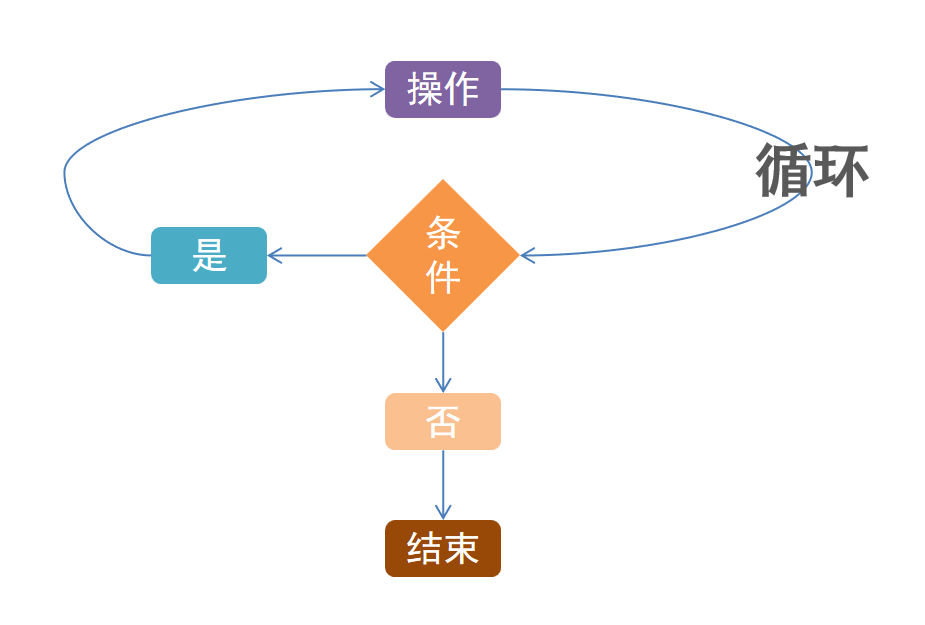

循环在程序中同判断一样，也是广泛存在的，是非常多功能实现的基础。

循环同样是程序最基础、最核心的逻辑功能。

## 一、while 循环的基础应用

生活中的循环：
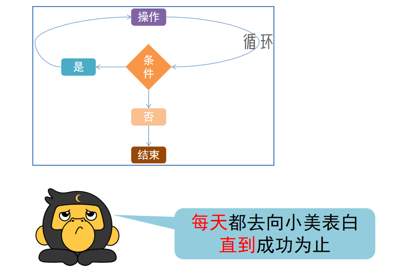

`while` 循环语句的语法格式：
```python
while 条件:
    条件满足时，做的事情 1
    条件满足时，做的事情 2
    条件满足时，做的事情 3
    ...（省略）...
```
由上述语法格式可知：只要条件满足，会无限循环执行。

设置循环终止条件的 `while` 循环语句的语法格式：
```python
i = 0
while i < 100:
    ...（省略）...
    i += 1
```

`while` 循环注意点：
* `while` 的条件需得到布尔类型：`True` 表示继续循环，`False` 表示结束循环。
* 需要设置循环终止的条件：如 `i += 1` 配合 `i < 100`，就能确保 100 次后停止，否则将无限循环。
* 空格缩进和 `if` 判断一样，都需要设置。

## 二、while 循环猜数字案例

猜数字案例：
> 设置一个范围 1 - 100 的随机整数变量，通过 `while` 循环，配合 input 语句，判断输入的数字是否等于随机数。
>
> 要求：
> * 无限次机会，直到猜中为止；
> * 每一次猜不中，会提示大了或小了；
> * 猜完数字后，提示猜了几次。
>
> 提示：
> * 无限次机会，终止条件不适合用数字累加来判断：
>   * 可以考虑布尔类型本身（`True` or `False`）。
> * 需要提示几次猜中，就需要提供数字累加功能。
> * 随机数可以使用：
>   ```python
>   import random
>   num = random.randint(1, 100)
>   ```
> 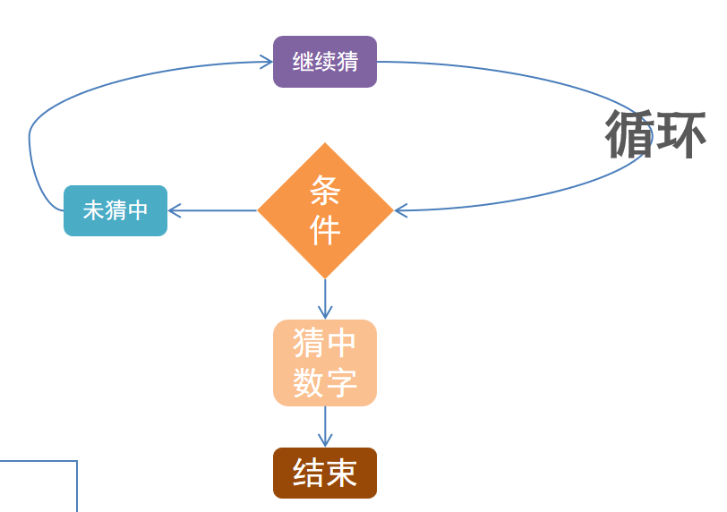

示例代码：
```python
"""
演示 while 循环的基础案例 - 猜数字
"""
# 获取范围在 1 - 100 的随机数字
import random
num = random.randint(1, 100)
# 定义一个变量，记录总共猜测了多少次
count = 0

# 通过一个布尔类型的变量，做循环是否继续的标记
flag = True
while flag:
    guess_num = int(input("请输入你猜测的数字："))
    count += 1
    if guess_num == num:
        print("猜中了")
        # 设置为 False 就是终止循环的条件
        flag = False
    else:
        if guess_num > num:
            print("你猜的大了")
        else:
            print("你猜的小了")

print(f"你总共猜测了 {count} 次")
```

## 三、while 循环的嵌套应用

生活中的嵌套循环：
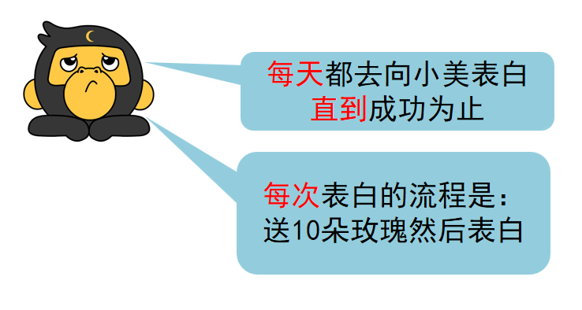

`while` 循环的嵌套的语法格式：
```python
while 条件 1:
    条件 1 满足时，做的事情 1
    条件 1 满足时，做的事情 2
    条件 1 满足时，做的事情 3
    ...（省略）...

    while 条件 2:
        条件 2 满足时，做的事情 1
        条件 2 满足时，做的事情 2
        条件 2 满足时，做的事情 3
        ...（省略）...
```
示例代码：
```python
# 表白 100 天
# 每一天都会送 10 朵玫瑰花
i = 1
while i <= 100:
    print(f"今天是第 {i} 天，准备表白……")
    j = 1
    while j <= 10:
        print(f"送给小美第 {j} 只玫瑰花")
        j += 1
    print("小美，我喜欢你")
    i += 1

print(f"坚持到第 {i - 1} 天，表白成功")
```
`while` 循环的嵌套的注意点：
* 同判断语句的嵌套一样，循环语句的嵌套也要注意空格缩进：
  * 基于空格缩进来决定层次关系。
* 注意条件的设置，避免出现无限循环（除非真的需要无限循环）。

## 四、while 循环案例 - 九九乘法表

### 4.1 补充知识 - print 输出不换行

默认 `print` 语句输出内容会自动换行。在即将完成的案例中，我们需要使用 `print` 语句的输出不换行的功能，实现方式如下：
```python
print("Hello", end='')
print("World", end='')
```
输出结果：
```python
HelloWorld
```

如上述代码所示，在 `print` 语句中加上 `end=''`，即可输出不换行了。

> 注意：`end=''` 是使用的方法传参功能，我们在后面会详细讲解。

### 4.2 补充知识 - 制表符 `\t`

在字符串中，有一个特殊符号 `\t`，效果等同于在键盘上按下 tab 键，它可以让我们的多行字符串进行对齐。

示例代码：
```python
# 使用空格无法对齐
print("Hello World")
print("itheima best")

# 使用 \t 后，可以对齐
print("Hello\tWorld")
print("itheima\tbest")
```
输出结果：
```python
Hello World
itheima best
Hello   World
itheima best
```

### 4.3 练习案例 - 打印九九乘法表

练习案例 - 打印九九乘法表：
> 通过 `while` 循环，输出如下九九乘法表内容：
> 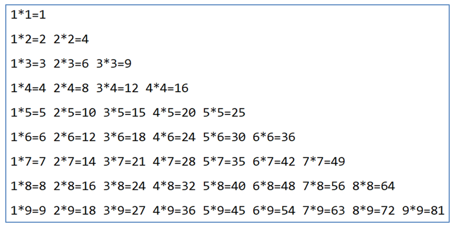
>
> 提示：
> * 2 层循环，外层控制行，内层控制列；
> * 通过设置外层循环和内层循环的累加数字变量，用以辅助输出乘法表的数值。

示例代码：
```python
"""
演示使用 while 的嵌套循环
打印输出九九乘法表
"""

# 定义外层循环的控制变量
i = 1
while i <= 9:

    # 定义内层循环的控制变量
    j = 1
    while j <= i:
        # 内层循环的 print 语句，不要换行，通过 \t 制表符进行对齐
        print(f"{j} * {i} = {j * i}\t", end = '')
        j += 1

    i += 1
    print() # print 空内容，就是输出一个换行
```

## 五、for 循环的基础语法

除了 `while` 循环语句外，Python 同样提供了 `for` 循环语句。

两者能完成的功能基本差不多，但仍有一些区别：
* `while` 循环的循环条件是自定义的，自行控制循环条件；
* `for` 循环是一种“轮询”机制，是对一批内容进行“逐个处理”。

`while` 循环与 `for` 循环的比较：
* `while` 循环：
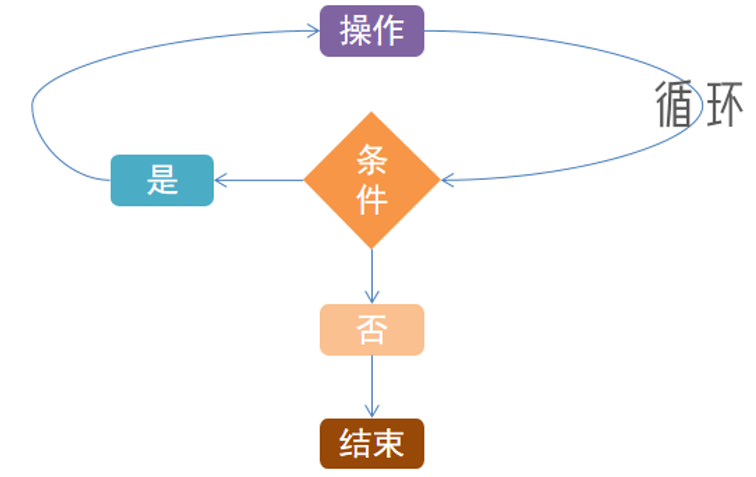
* `for` 循环：
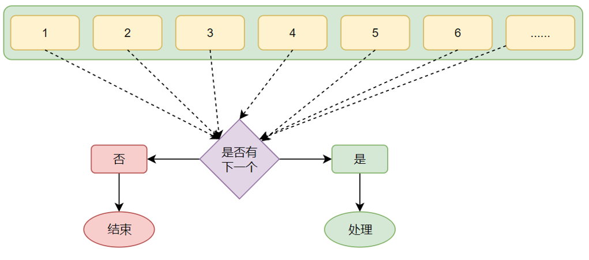

因此，`for` 循环就是将“待办事项”逐个完成的循环机制。

生活中的 `for` 循环：
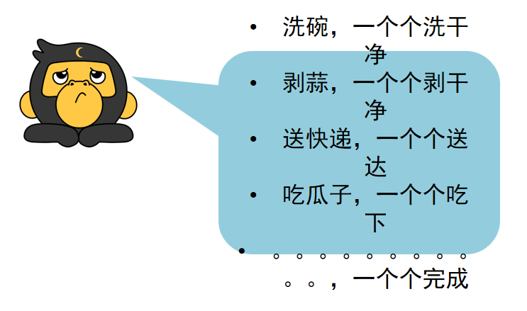

`for` 循环的语法格式：
```python
for 临时变量 in 待处理数据集（序列）:
    循环满足条件时执行的代码
```

`for` 循环将会从待处理数据集中：逐个取出数据赋值给临时变量。

使用 `for` 循环语句遍历字符串：
```python
# 定义字符串 name
name = "itheima"
# for 循环处理字符串
for x in name:
    print(x)
```
由上述代码可以看出，`for` 循环是将字符串的内容依次取出。所以，`for` 循环也被称之为遍历循环。

同 `while` 循环不同：`for` 循环是无法定义循环条件的，只能从被处理的数据集中依次取出内容进行处理。所以，理论上讲，Python 的 `for` 循环无法构建无限循环（被处理的数据集不可能无限大）。

`for` 循环的注意点：
* 无法定义循环条件，只能被动取出数据处理；
* 要注意，循环内的语句，需要有空格缩进。

## 六、range 语句

对于 `for` 循环的语法格式：
```python
for 临时变量 in 待处理数据集（可迭代对象）:
    循环满足条件时执行的代码
```
其中，语法中的待处理数据集严格来说称之为可迭代类型（序列类型）。可迭代类型（序列类型）指其内容可以一个个依次取出的一种类型，包括字符串、列表、元组等；目前我们只学习了字符串类型，其余类型在后续章节会详细学习它们。

`for` 循环语句本质上是遍历可迭代对象（序列类型）。尽管除字符串外，其他可迭代类型（序列类型）目前没学习到，但不妨碍我们通过学习 `range` 语句获得一个简单的数字序列（可迭代类型的一种）。

range 语句的语法：
1. 语法 1：
```python
range(num)
```
获取一个从 `0` 开始到 `num` 结束的数字序列（不含 `num` 本身）。
如 `range(5)` 取得的数据是：`[0, 1, 2, 3, 4]`。

2. 语法 2：
```python
range(num1, num2)
```
获得一个从 `num1` 开始到 `num2` 结束的数字序列（不含 `num2` 本身）。
如 `range(5, 10)` 取得的数据是：`[5, 6, 7, 8, 9]`。

3. 语法 3：
```python
range(num1, num2, step)
```
获得一个从 `num1` 开始到 `num2` 结束的数字序列（不含 `num2` 本身），数字之间的步长以 `step` 为准（`step` 默认为 `1`）。
如 `range(5, 10, 2)` 取得的数据是：`[5, 7, 9]`。

`for` 循环遍历 `range` 序列：
```python
# for 循环处理字符串
for i in range(5):
    print(i)
```
输出结果：
```python
0
1
2
3
4

```

## 七、for 循环临时变量作用域

如下图所示：
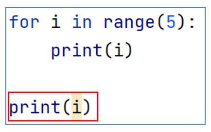
思考一下：红框中的 `print` 语句，能否访问到变量 `i`？
* 规则上：不允许；
* 实际上：可以。

`for` 循环的语法格式：
```python
for 临时变量 in 待处理数据集:
    循环满足条件时执行的代码
```
回看 `for` 循环的语法，我们会发现，`for` 循环将从数据集（序列）中取出的数据赋值给临时变量。为什么是临时的呢？

在编程规范上，临时变量的作用范围（作用域）只限定在 `for` 循环内部。如果在 `for` 循环外部访问临时变量：
* 实际上是可以访问到的；
* 在编程规范上，是不允许、不建议这么做的。

如果实在需要在循环外访问循环内的临时变量，可以在循环外预先定义：
```python
i = 0
for i in range(5):
    print(i)

print(i)
```
如上述代码所示，每一次循环的时候，都会将取出的值赋予 `i` 变量。由于 `i` 变量是在循环之前（外）定义的，因此在循环外访问 `i` 变量是合理的、允许的。

## 八、for 循环的嵌套使用

同 `while` 一样，`for` 循环也支持嵌套使用。

生活中的嵌套循环：
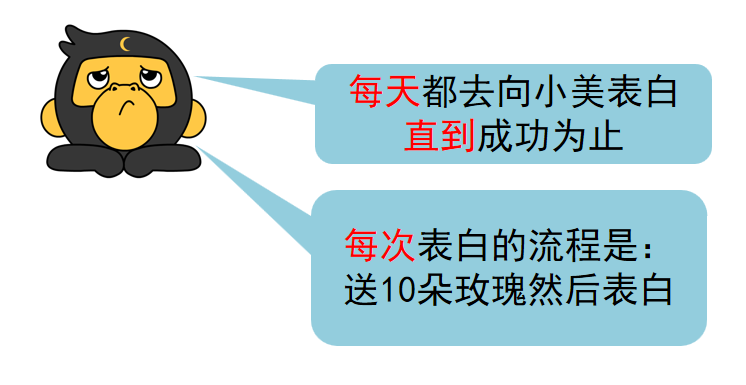

嵌套 `for` 循环的语法格式：
```python
for 临时变量 in 待处理数据集（序列）:
    循环满足条件应做的事情 1
    循环满足条件应做的事情 2
    循环满足条件应做的事情 N
    ...
    for 临时变量 in 待处理数据集（序列）:
        循环满足条件应做的事情 1
        循环满足条件应做的事情 2
        循环满足条件应做的事情 N
```

同样以向小美表白的案例为例：
* 坚持表白 100 天；
* 每天送花 10 束。
```python
# 表白 100 天
# 每一天都会送 10 朵玫瑰花
i = 1
for i in range(1, 101):
    print(f"今天是向小美表白的第 {i} 天，坚持！")
    for j in range(1, 11):
        print(f"送给小美的第 {j} 朵玫瑰花")
    print(f"小美，我喜欢你（第 {i} 天的表白结束）")

print(f"第 {i} 天，表白成功")
```

`for` 循环的嵌套注意点：
* 如下如所示，和 `while` 循环一样，需要注意缩进；因为通过缩进，确定层次关系：
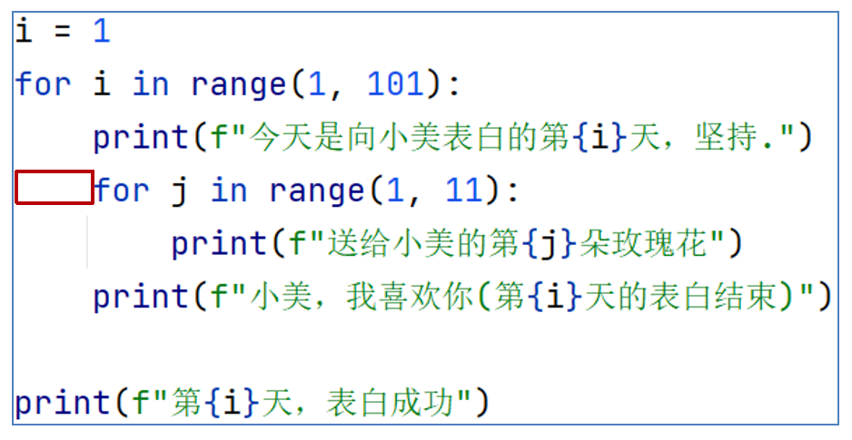
* 我们目前学习了 2 个循环，分别为 `while` 循环和 `for` 循环，这两类循环语句是可以相互嵌套的。例如，小美表白的案例可以改为如下代码所示（举例 `while` 循环内嵌套 `for` 循环，同理可将该案例修改为 `for` 循环内嵌套 `while` 循环）：
    ```python
    i = 1
    while i <= 100:
        print(f"今天是向小美表白的第 {i} 天，坚持！")
        for j in range(1, 11):
            print(f"送给小美的第 {j} 朵玫瑰花")
        print(f"小美，我喜欢你（第 {i} 天的表白结束）")
        i += 1

    print(f"表白第 {i - 1} 天，表白成功")
    ```

## 九、continue 和 break

Python 提供 `continue` 和 `break` 关键字，用以对循环进行临时跳过和直接结束。

### 9.1 continue

`continue` 关键字用于中断本次循环，直接进入下一次循环。

`continue` 可以用于 `for` 循环和 `while` 循环，效果一致。

生活中的 `continue`：
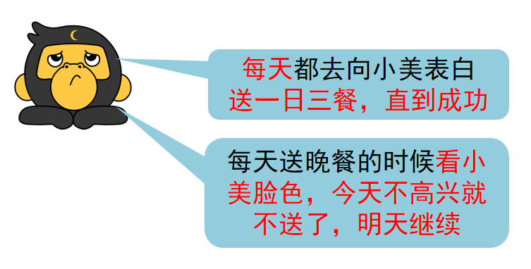
示例代码：
```python
for i in range(1, 101):
    print(f"追求小美的第 {i} 天，坚持……")
    print("给小美送早饭，比心")
    print("给小美送午饭，比心")
    if input(f"今天小美的心情好像（0 好心情，1 坏心情）") == '1':
        print("小美心情不好，晚饭不送了，撤退……")
        print()
        continue
    print("给小美送晚饭，送小美回家并表白")
    print()
```

`continue` 关键字只可以控制它所在的循环临时中断。例如：
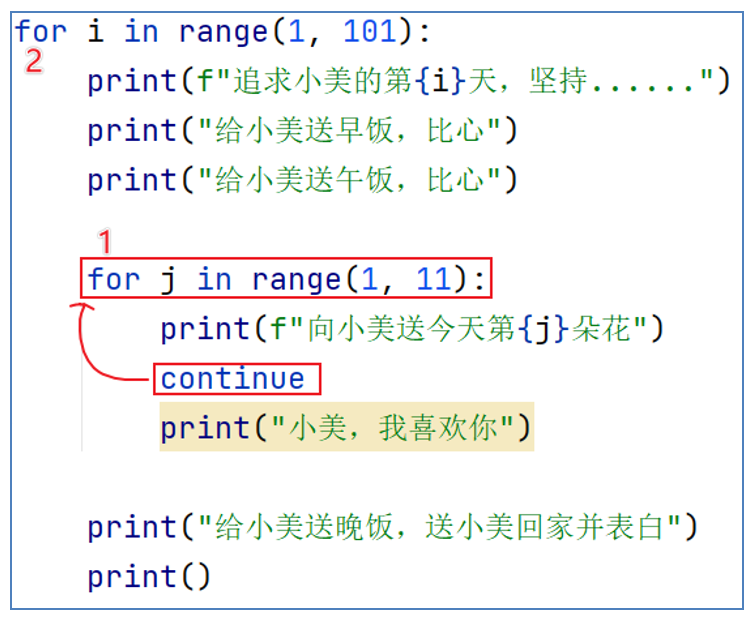
`continue` 只能控制上图编号 1 的 `for` 循环，对编号 2 的 `for` 循环无影响。

### 9.2 break

`break` 关键字用于直接结束所在循环。

`break` 可以用于 `for` 循环和 `while` 循环，效果一致。

生活中的 `break`：
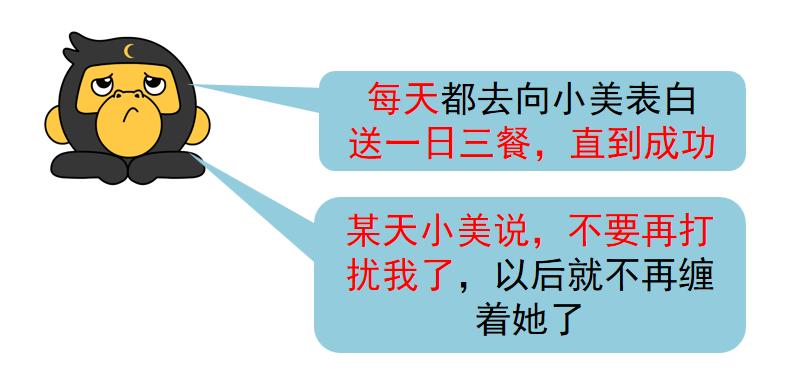
示例代码：
```python
for i in range(1, 101):
    print(f"追求小美的第 {i} 天，坚持……")
    print("给小美送早饭，比心")
    print("给小美送午饭，比心")
    if input(f"如果你是小美，请告诉我你是否明确拒绝（0 再观察观察，1 不合适拒绝）") == '1':
        print("小美拒绝我了，以后不追求小美了。T.T")
        break
    print("给小美送晚饭，送小美回家并表白")
    print()
```

`break` 关键字同样只可以控制它所在的循环永久中断。例如：
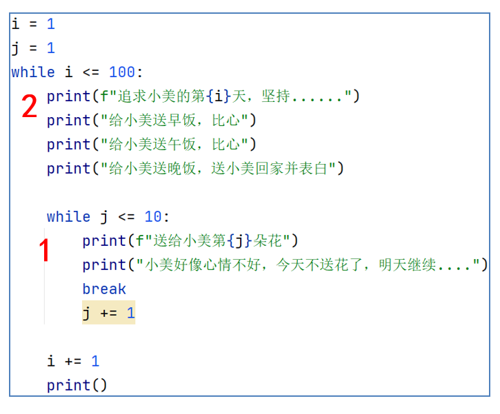
`break` 只能控制上图编号 1 的循环，对编号 2 的循环无影响。

## 十、循环综合案例

练习案例：
> 发工资：
> 某公司，账户余额有 1W 元，给 20 名员工发工资。
> * 员工编号从 1 到 20，从编号 1 开始，依次领取工资，每人可领取 1000 元；
> * 领工资时，财务判断员工的绩效分（1 - 10）（随机生成），如果低于 5，不发工资，换下一位；
> * 如果工资发完了，结束发工资。
>
> 提示：
> * `continue` 用于跳过员工，`break` 直接结束发工资；
> if 判断余额，不要忘记发工资后，余额减少 1000 哦。

示例代码：
```python
"""
演示循环综合案例：发工资
"""

# 定义账户余额变量
money = 10000
# for 循环对员工发放工资
for i in range(1, 21):
    import random
    score = random.randint(1, 10)

    if score < 5:
        print(f"员工 {i} 绩效分 {score}，不满足，不发工资，下一位")
        # continue 跳过发放
        continue

    # 要判断余额足不足
    if money >= 1000:
        money -= 1000
        print(f"员工 {i}，满足条件，发放工资 1000，公司账户余额：{money}")
    else:
        print(f"余额不足，当前余额：{money} 元，不足以发工资，不发了，下个月再来")
        #break 结束发放
        break
```