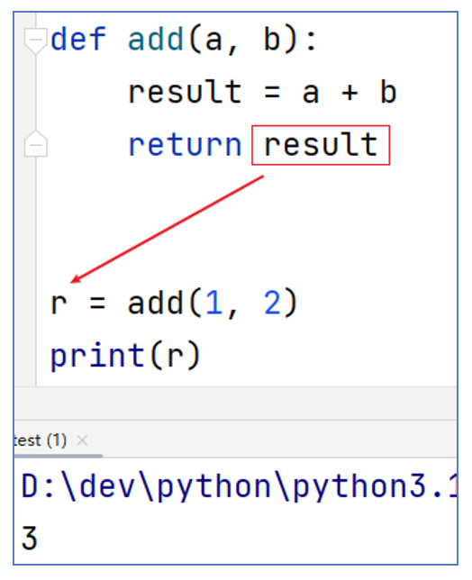

# 第一阶段 - 第五章

**目录：**

[TOC]

---

## 一、函数的初体验

函数：是组织好的、可重复使用的、用来实现特定功能的代码段。
我们使用过的 `input()`、`print()`、`str()`、`int()` 等都是 Python 的内置函数。

示例案例：
> 不使用内置函数 `len()`，完成字符串长度的计算。
```python
"""
演示：快速体验函数的开发及应用
"""
# 需求：统计字符串的长度，不使用内置函数 len()
str1 = "itheima"
str2 = "itcast"
str3 = "python"

# 定义一个计数的变量
count = 0
for i in str1:
    count += 1
print(f"字符串 {str1} 的长度是：{count}")

count = 0
for i in str2:
    count += 1
print(f"字符串 {str2} 的长度是：{count}")

count = 0
for i in str3:
    count += 1
print(f"字符串 {str3} 的长度是：{count}")

# 可以使用函数，来优化这个过程
def my_len(data):
    count = 0
    for i in data:
        count += 1
    print(f"字符串 {data} 的长度是 {count}")

my_len(str1)
my_len(str2)
my_len(str3)
```

为什么要学习、使用函数呢？
* 为了得到一个针对特定需求、可供重复利用的代码段；
* 提高程序的复用性，减少重复性代码，提高开发效率。

## 二、函数的基础定义语法

函数的定义：
```python
def 函数名(传入参数):
    函数体
    return 返回值
```

函数的调用：
```python
函数名(参数)
```

> 注意事项：
> * 参数如不需要，可以省略（后续章节讲解）；
> * 返回值如不需要，可以省略（后续章节讲解）；
> * 函数必须先定义后使用。

## 三、函数的传入参数

传入参数的功能是：在函数进行计算的时候，接受外部（调用时）提供的数据。

有如下代码，完成了 2 个数字相加的功能：
```python
def add():
    result = 1 + 2
    print(f"1 + 2 的结果是：{result}")
```
函数的功能非常局限，只能计算 `1 + 2`。有没有可能实现：每一次使用函数可以去计算用户指定的 2 个数字，而非每次都是 `1 + 2` 呢？
* 可以的，使用函数的传入参数功能，即可实现。

函数的传入参数 - 传参定义：
```python
def add(x, y):
    result = x + y
    print(f"{x} + {y} 的结果是：{result}")
```
上述代码实现了每次计算的是 `x + y`，而非固定的 `1 + 2`。其中 `x` 与 `y` 的值可以在调用函数的时候指定。
对上述代码进行语法解析：
```python
# 定义函数
def add(x, y):
    result = x + y
    print(f"{x} + {y} 的结果是：{result}")

# 调用函数
add(5, 6)
```
其中：
* 函数定义中，提供的 `x` 和 `y`，称之为形式参数（形参），表示函数声明将要使用 2 个参数；
  * 参数之间使用逗号进行分隔。
* 函数调用中，提供的 `5` 和 `6`，称之为实际参数（实参），表示函数执行时真正使用的参数值；
  * 传入的时候，按照顺序传入数据，使用逗号分隔。

传入参数的数量是不受限制的：
* 可以不使用参数；
* 也可以仅使用任意 N 个参数。

## 四、函数的返回值

### 4.1 函数的返回值定义语法

生活中的返回值：


程序中的返回值：
```python
def add(a, b):
    result = a + b
    return result

r = add(1, 2)
print(r)
```
输出结果：

如上述代码定义两数相加的函数功能。完成功能后，会将相加的结果返回给函数调用者；所以，变量 `r` 接收到了函数的执行结果。

综上所述：所谓“返回值”，就是程序中函数完成事情后，最后给调用者的结果。

返回值的语法格式：
```python
def 函数(参数 ...):
    函数体
    return 返回值

变量 = 函数(参数)
```
如上述代码所示，变量就能接收到函数的返回值。
语法就是：通过 `return` 关键字，就能向调用者返回数据。

需要注意的是，函数体在遇到 `return` 后就结束了，所以写在 `return` 后的代码不会执行。

### 4.2 函数返回值之 None 类型

思考：如果函数没有使用 `return` 语句返回数据，那么函数有返回值吗？
* 实际上是：有的。

Python 中有一个特殊的字面量 `None`，其类型是 `<class 'NoneType'>`。
无返回值的函数，实际上就是返回了 `None` 这个字面量。

`None` 表示空的、无实际意义的意思。函数返回的是 `None`，就表示这个函数没有返回什么有意义的内容，也就是返回了 空 的意思。

示例代码：
```python
def say_hello():
    print("Hello ...")

# 使用变量接收 say_hello 函数的返回值
result = say_hello()
# 打印返回值
print(result)   # 结果 None
# 打印返回值类型
print(type(result)) # 结果 <class 'NoneType'>
```

`None` 可以主动使用 `return` 返回，效果等同于不写 `return` 语句：
```python
def say_hello():
    print("Hello ...")
    return None

# 使用变量接收 say_hello 函数的返回值
result = say_hello()
# 打印返回值
print(result)   # 结果 None
```
综上所述，函数如何返回 `None`：
* 不使用 `return` 语句即返回 `None`；
* 主动 `return None`。

`None` 作为一个特殊的字面量，用于表示 空、无意义，其有非常多的应用场景：
* 用在函数无返回值上。
* 用在 `if` 判断上：
  * 在 `if` 判断中，`None` 等同于 `False`；一般用于在函数中主动返回 `None`，配合 `if` 判断做相关处理。
    * 示例代码：
        ```python
        def check_age(age):
            if age > 18:
                return "SUCCESS"
            return None

        result = check_age(5)
        if not result:
            print("未成年，不可进入")
        ```
* 用于声明无内容的变量上：
  * 定义变量，但暂时不需要变量有具体值，可以用 `None` 来代替。
    * 示例代码：
        ```python
        # 暂不赋予变量具体值
        name = None
        ```
