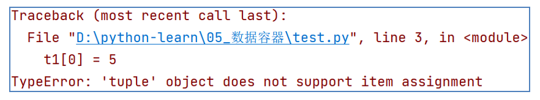
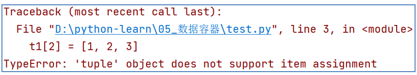
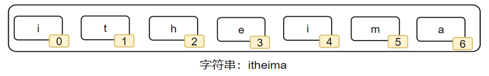
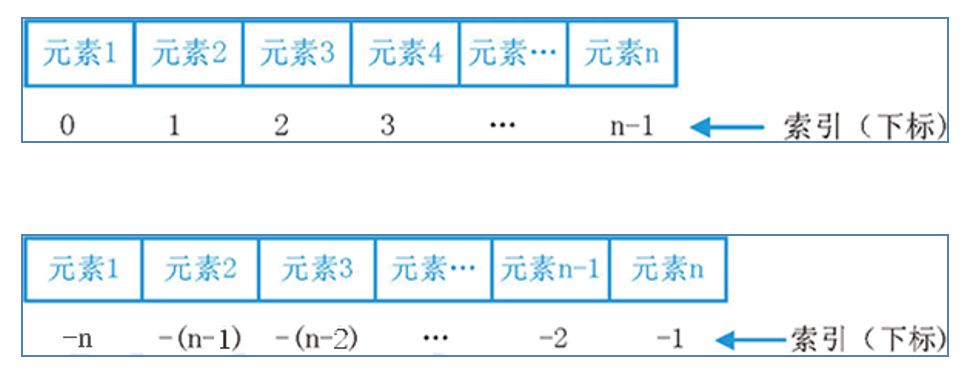

# 第一阶段 - 第六章

**目录：**

[TOC]

---

## 一、数据容器入门

数据容器可以优雅、高效地通过一个变量完成记录多份数据的任务，即一个容器可以容纳多份数据。

学习数据容器，就是为了批量存储或批量使用多份数据。

Python 中的数据容器是一种可以容纳多份数据的数据类型，容纳的每一份数据称之为 1 个元素，每一个元素可以是任意类型的数据，如字符串、数字、布尔等。数据容器如下图所示：


数据容器根据特点的不同，如是否支持重复元素、是否可以修改、是否有序等，分为 5 类，分别是：列表（`list`）、元组（`tuple`）、字符串（`str`）、集合（`set`）、字典（`dict`）。它们各有特点，但都满足可容纳多个元素的特性。

## 二、列表（list）

### 2.1 列表的定义语法

列表（`list`）类型，是数据容器的一类。

列表的定义的基本语法：
```python
# 字面量
[元素 1, 元素 2, 元素 3, 元素 4, ...]

# 定义变量
变量名称 = [元素 1, 元素 2, 元素 3, 元素 4 ...]

# 定义空列表
变量名称 = []
变量名称 = list()
```

列表内的每一个数据，称之为元素。

> 注意：
> * 列表以 `[]` 作为标识；
> * 列表内每一个元素之间用逗号（`,`）隔开。

列表可以一次存储多个数据，且可以为不同的数据类型，支持嵌套。

> 注意：列表内的元素的数据类型没有任何限制，甚至元素也可以是列表，这样就定义了嵌套列表。

示例代码 1：
```python
name_list = ['itheima', 'itcast', 'python']
print(name_list)
print(type(name_list))
```
输出结果：
```python
['itheima', 'itcast', 'python']
<class 'list'>
```

示例代码 2：
```python
my_list = ['itheima', 666, True]
print(my_list)
print(type(my_list))
```
输出结果：
```python
['itheima', 666, True]
<class 'list'>
```

示例代码 3：
```python
# 嵌套列表的定义
my_list = [[1, 2, 3], [4, 5, 6]]
print(my_list)
print(type(my_list))
```
输出结果：
```python
[[1, 2, 3], [4, 5, 6]]
<class 'list'>
```

### 2.2 列表的下标索引

我们可以使用下标索引从列表中取出特定位置的数据。


如上图所示，列表中的每一个元素，都有其位置下标索引；从前向后的方向，位置下标索引从 0 开始，且依次递增。

我们只需要按照下标索引，即可取得对应位置的元素：
```python
列表[下标索引]
```
示例代码：
```python
# 语法：列表[下标索引]

name_list = ['Tom', 'Lily', 'Rose']
print(name_list[0]) # 结果：Tom
print(name_list[1]) # 结果：Lily
print(name_list[2]) # 结果：Rose
```

或者，可以使用反向索引，也就是从后向前的方向，位置下标索引从 -1 开始，依次递减（-1、-2、-3 ……）


如上图所示，从后向前，下标索引为 -1、-2、-3 ……，且依次递减。

我们也只需要按照下标索引，即可取得对应位置的元素：
```python
列表[标号]
```
示例代码：
```python
# 语法：列表[标号]

name_list = ['Tom', 'Lily', 'Rose']
print(name_list[-1])    # 结果：Rose
print(name_list[-2])    # 结果：Lily
print(name_list[-3])    # 结果：Tom
```

如果列表是嵌套的列表，同样支持下标索引：


如上图所示，下标就有 2 个层级了：
```python
# 2 层嵌套 list
my_list = [[1, 2, 3], [4, 5, 6]]

# 获取内层第一个 list
print(my_list[0])   # 结果：[1, 2, 3]

# 获取内层第一个 list 的第一个元素
print(my_list[0][0])    # 结果：1
```

> 下标索引的注意事项：要注意下标索引的取值范围，超出范围无法取出元素，并且会报错。

### 2.3 列表的常用操作方法

列表除了可以定义、使用下标索引获取值以外，列表也提供了插入元素、删除元素、清空列表、修改元素、统计元素个数等等一系列功能，这些功能我们都称之为列表的方法。

列表的方法 - 总览：
| 编号 | 使用方式 | 作用 |
| :--: | :--: | :--: |
| 1 | `列表.append(元素)` | 向列表中追加一个元素 |
| 2 | `列表.extend(容器)` | 将数据容器的内容依次取出，追加到列表尾部 |
| 3 | `列表.insert(下标, 元素)` | 在指定下标处，插入指定的元素 |
| 4 | `del 列表[下标]` | 删除列表指定下标元素 |
| 5 | `列表.pop(下标)` | 删除列表指定下标元素 |
| 6 | `列表.remove(元素)` | 从前向后，删除此元素第一个匹配项 |
| 7 | `列表.clear()` | 清空列表 |
| 8 | `列表.count(元素)` | 统计此元素在列表中出现的次数 |
| 9 | `列表.index(元素)` | 查找指定元素在列表的下标，找不到报错 `ValueError` |
| 10 | `len(列表)` | 统计容器内有多少元素 |

回忆：函数是一个封装的代码单元，可以提供特定功能。

在 Python 中，如果将函数定义为 `class`（类）的成员，那么函数会称之为方法：


方法和函数功能一样，有传入参数，有返回值，只是方法的使用格式不同：
* 函数的使用：
    ```python
    num = add(1, 2)
    ```
* 方法的使用：
    ```python
    student = Student()
    num = student.add(1, 2)
    ```

关于类和方法的定义，在面向对象章节我们学习，目前我们知道如何使用方法即可。

#### 2.3.1 列表的查询功能（方法）

查找某元素的下标：
* 功能：查找指定元素在列表的下标，如果找不到，报错 `ValueError`。
* 语法：`列表.index(元素)`。
> `index` 就是列表对象（变量）内置的方法（函数）。
* 示例代码：
    ```python
    my_list = ["itheima", "itcast", "python"]
    print(my_list.index("itcast"))  # 结果：1
    ```

#### 2.3.2 列表的修改功能（方法）

修改特定位置（索引）的元素值：
* 功能：直接对指定下标（正向、反向下标均可）的值进行重新赋值（修改）。
* 语法：`列表[下标] = 值`。
* 示例代码：
    ```python
    # 正向下标
    my_list = [1, 2, 3]
    my_list[0] = 5
    print(my_list)  # 结果：[5, 2, 3]

    # 反向下标
    my_list = [1, 2, 3]
    my_list[-3] = 5
    print(my_list)  # 结果：[5, 2, 3]
    ```

插入元素：
* 功能：在指定的下标位置，插入指定的元素。
* 语法：`列表.insert(下标, 元素)`。
* 示例代码：
    ```python
    my_list = [1, 2, 3]
    my_list.insert(1, "itheima")
    print(my_list)  # 结果：[1, "itheima", 3, 4]
    ```

追加元素：
* 方式 1：
  * 功能：将指定元素，追加到列表的尾部。
  * 语法：`列表.append(元素)`。
  * 示例代码：
    ```python
    my_list = [1, 2, 3]
    my_list.append(4)
    print(my_list)  # 结果：[1, 2, 3, 4]

    my_list = [1, 2, 3]
    my_list.append([4, 5, 6])
    print(my_list)  # 结果：[1, 2, 3, [4, 5, 6]]
    ```
* 方式 2：
  * 功能：将其他数据容器的内容取出，依次追加到列表尾部。
  * 语法：`列表.extend(其他数据容器)`。
  * 示例代码：
    ```python
    my_list = [1, 2, 3]
    my_list.extend([4, 5, 6])
    print(my_list)  # 结果：[1, 2, 3, 4, 5, 6]
    ```

删除元素：
* 语法 1：`del 列表[下标]`。
  * 示例代码：
    ```python
    my_list = [1, 2, 3]

    # 方式 1
    del my_list[0]
    print(my_list)  # 结果：[2, 3]
    ```
* 语法 2：`element = 列表.pop(下标)`。
  * 示例代码：
    ```python
    my_list = [1, 2, 3]

    # 方式 2
    my_list.pop(0)
    print(my_list)  # 结果：[2, 3]
    ```

删除某元素在列表中的第一个匹配项：
* 语法：`列表.remove(元素)`。
* 示例代码：
    ```python
    my_list = [1, 2, 3, 2, 3]
    my_list.remove(2)
    print(my_list)  # 结果：[1, 3, 2, 3]
    ```

清空列表内容：
* 语法：`列表.clear()`。
* 示例代码：
    ```python
    my_list = [1, 2, 3]
    my_list.clear()
    print(my_list)  # 结果：[]
    ```

#### 2.3.3 列表的查询功能（方法）

统计某元素在列表内的数量：
* 语法：`列表.count(元素)`。
* 示例代码：
    ```python
    my_list = [1, 1, 1, 2, 3]
    print(my_list.count(1)) # 结果：3
    ```

统计列表内有多少元素：
* 功能：可以得到一个 `int` 数字，表示列表内的元素数量。
* 语法：`len(列表)`。
* 示例代码：
```python
my_list = [1, 2, 3, 4, 5]
print(len(my_list)) # 结果：5
```

### 2.4 列表的循环遍历

既然数据容器可以存储多个元素，那么，就会有需求从容器内依次取出元素进行操作。

将容器内的元素依次取出进行处理的行为，称之为：遍历、迭代。

#### 2.4.1 列表的遍历 - while 循环

如何遍历列表的元素呢？
* 可以使用前面学过的 `while` 循环。

如何在循环中取出列表的元素呢？
* 使用 `列表[下标]` 的方式取出。

循环条件如何控制？
* 定义一个变量表示下标，从 0 开始；
* 循环条件为 `下标值 < 列表` 的元素数量。

示例代码：
```python
index = 0
while index < len(列表):
    元素 = 列表[index]
    对元素进行处理
    index += 1
```

#### 2.4.2 列表的遍历 - for 循环

除了 `while` 循环外，Python 中还有另外一种循环形式：`for` 循环。
对比 `while`，`for` 循环更加适合对列表等数据容器进行遍历。

`for` 循环遍历列表的语法：
```python
for 临时变量 in 数据容器:
    对临时变量进行处理
```
上述代码表示从容器内依次取出元素并赋值到临时变量上；在每一次的循环中，我们可以对临时变量（元素）进行处理。

示例代码：
```python
my_list = [1, 2, 3, 4, 5]
for i in my_list:
    print(i)
```
输出结果：
```python
1
2
3
4
5

```
对于上述示例代码，每一次循环将列表中的元素取出，赋值到变量 `i`，供操作。

#### 2.4.3 while 循环和 for 循环的对比

`while` 循环和 `for` 循环，都是循环语句，但细节不同：
* 在循环控制上：
  * `while` 循环可以自定循环条件，并自行控制；
  * `for` 循环不可以自定循环条件，只可以一个个从容器内取出数据。
* 在无限循环上：
  * `while` 循环可以通过条件控制做到无限循环；
  * `for` 循环理论上不可以，因为被遍历的容器容量不是无限的。
* 在使用场景上：
  * `while` 循环适用于任何想要循环的场景；
  * `for` 循环适用于遍历数据容器的场景或简单的固定次数循环场景。

> 总结：
> * `for` 循环更简单，`while` 循环更灵活；
> * `for` 循环用于从容器内依次取出元素并处理，`while` 循环用以任何需要循环的场景。

### 2.5 列表总结

经过上述对列表的学习，可以总结出列表有如下特点：
* 可以容纳多个元素（上限为 2 ** 63 - 1，即 9223372036854775807 个）；
* 可以容纳不同类型的元素（混装）；
* 数据是有序存储的（有下标序号）；
* 允许重复数据存在；
* 可以修改（增加或删除元素等）。

## 三、元组（tuple）

思考：列表是可以修改的；如果想要传递的信息不被篡改，列表就不合适了。

元组同列表一样，都是可以封装多个、不同类型的元素在内；但最大的不同点在于：元组一旦定义完成，就不可修改。

所以，当我们需要在程序内封装数据，又不希望封装的数据被篡改，那么元组就非常合适了。

### 3.1 定义元组

元组定义：定义元组使用小括号，且使用逗号隔开各个数据，数据可以是不同的数据类型。
示例代码：
```python
# 定义元组字面量
(元素, 元素, 元素, ..., 元素)

# 定义元组变量
变量名称 = (元素, 元素, ..., 元素)

# 定义空元组
变量名称 = ()   # 方式 1
变量名称 = tuple()  # 方式 2（得到元组的类对象）
```

元组也支持嵌套：
```python
# 定义一个嵌套元组
t1 = ((1, 2, 3), (4, 5, 6))
print(t1[0][0]) # 结果：1
```

> 注意：
> ```python
> # 定义 3 个元素的元组
> t1 = (1, 'Hello', True)
> 
> # 定义 1 个元素的元组
> t2 = ('Hello', )  # 注意：必须带有逗号，否则不是元组类型
> ```
> 如上述代码所示，当元组只有一个数据时，这个数据后面要添加逗号。

### 3.2 元组的相关操作

元组由于不可修改的特性，所以其操作方法非常少：
| 编号 | 方法 | 作用 |
| :--: | :--: | :--: |
| 1 | `index()` | 查找某个数据，如果数据存在返回对应的下标，否则报错 |
| 2 | `count()` | 统计某个数据在当前元组出现的次数 |
| 3 | `len(元组)` | 统计元组内的元素个数 |

示例代码：
```python
# 根据下标（索引）取出数据
t1 = (1, 2, 'hello')
print(t1[2])    # 结果：'hello'

# 根据 index()，查找特定元素的第一个匹配项
t1 = (1, 2, 'hello', 3, 4, 'hello')
print(t1.index('hello'))    # 结果：2

# 统计某个数据在元组内出现的次数
t1 = (1, 2, 'hello', 3, 4, 'hello')
print(t1.count('hello'))    # 结果：2

# 统计元组内的元素个数
t1 = (1, 2, 3)
print(len(t1))  # 结果：3
```

注意事项：
* 不可以修改元组的内容，否则会直接报错：
  * 错误示例：
    ```python
    # 尝试修改元组内容
    t1 = (1, 2, 3)
    t1[0] = 5
    ```
    * 输出结果：
        
* 可以修改元组内的 `list` 的内容（修改元素、增加、删除、反转等）：
  * 示例代码：
    ```python
    # 尝试修改元组内容
    t1 = (1, 2, ['itheima', 'itcast'])
    t1[2][1] = 'best'
    print(t1)   # 结果：(1, 2, ['itheima', 'best'])
    ```
* 不可以替换 `list` 为其他 `list` 或其他类型：
  * 错误示例：
    ```python
    # 尝试修改元组内容
    t1 = (1, 2, ['itheima', 'itcast'])
    t1[2] = [1, 2, 3]
    print(t1)
    ```
    * 输出结果：
        

### 3.3 元组的遍历

同列表一样，元组也可以被遍历。

可以使用 `while` 循环和 `for` 循环遍历它：
* while 循环：
```python
my_tuple = (1, 2, 3, 4, 5)
index = 0
while index < len(my_tuple):
    print(my_tuple(index))
    index += 1
```
* for 循环：
```python
my_tuple = (1, 2, 3, 4, 5)
for i in my_tuple:
    print(i)
```

上述两种循环遍历方式的输出结果均为：
```python
1
2
3
4
5

```

### 3.4 元组总结

经过上述对元组的学习，可以总结出元组有如下特点：
* 可以容纳多个数据；
* 可以容纳不同类型的数据（混装）；
* 数据是有序存储的（下标索引）；
* 允许重复数据存在；
* 不可以修改（增加或删除元素等）；
* 支持 `for` 循环。

多数特性和 `list` 一致，不同点在于不可修改的特性。

## 四、字符串（str）

### 4.1 再识字符串

尽管字符串看起来并不像列表、元组那样一看就是存放了许多数据的容器；但不可否认的是，字符串同样也是数据容器的一员。

字符串是字符的容器，一个字符串可以存放任意数量的字符。如，字符串 `"itheima"`：


> 字符串为什么被称之为数据容器呢？
> * 字符串可以看做是字符的容器，支持下标索引等特性。

### 4.2 字符串的下标（索引）

和其他容器如列表、元组一样，字符串也可以通过下标进行访问：
* 从前向后，下标从 0 开始；
* 从后向前，下标从 -1 开始。

示例代码：
```python
# 通过下标获取特定位置字符
name = "itheima"
print(name[0])  # 结果：i
print(name[-1]) # 结果：a
```

同元组一样，字符串是一个无法修改的数据容器。所以，修改指定下标的字符（如 `字符串[0] = "a"`）、移除特定下标的字符（如 `del 字符串[0]`、`字符串.remove()`、`字符串.pop()` 等）、追加字符等（如 `字符串.append()`）均无法完成。如果必须要做，只能得到一个新的字符串，旧的字符串是无法修改。

### 4.3 字符串的常用操作

查找特定字符串的下标索引值：
* 语法：`字符串.index(字符串)`。
* 示例代码：
  ```python
  my_str = "itcast and itheima"
  print(my_str.index("and"))  # 结果：7
  ```

字符串的替换：
* 功能：将字符串内的全部 `字符串 1` 替换为 `字符串 2`。
* 语法：`字符串.replace(字符串 1, 字符串 2)`。
* 示例代码：
  ```python
  name = "itheima itcast"
  new_name = name.replace("it", "传智")

  print(new_name) # 结果：传智heima 传智cast
  print(name) # 结果：itheima itcast
  ```
> 注意：字符串的替换不是修改字符串本身，而是得到了一个新字符串。
> 
> 通过上述的示例代码可以看到，字符串 `name` 本身并没有发生变化，而是得到了一个新字符串对象。

字符串的分割：
* 功能：按照指定的分隔符字符串，将字符串划分为多个字符串，并存入列表对象中。
* 语法：`字符串.split(分隔符字符串)`。
* 示例代码：
  ```python
  name = "传智播客 传智教育 黑马程序员 博学谷"
  name_list = name.split(" ")

  print(name_list)  # 结果：['传智播客', '传智教育', '黑马程序员', '博学谷']
  print(type(name_list))  # 结果：<class 'list'>
  ```
> 注意：字符串进行分割操作后，字符串本身不变，而是得到了一个列表对象。
>
> 通过上述的示例代码可以看到，字符串按照给定的 <空格> 进行了分割，变成多个子字符串，并存入一个列表对象中。

字符串的规整操作：
* 去前后空格以及回车符：
  * 语法：`字符串.strip()`。
  * 示例代码：
    ```python
    my_str = "  itheima and itcast  "
    print(my_str.strip()) # 结果："itheima and itcast"
    ```
* 去前后指定字符串：
  * 语法：`字符串.strip(字符串)`。
  * 示例代码：
    ```python
    my_str = "12itheima and itcast21"
    print(my_str.strip("12")) # 结果："itheima and itcast"
    ```
> 注意：传入的是 `"12"`，其实就是 `"1"` 和 `"2"` 都会移除，即是按照传入的字符串的单个字符查询并移除。

统计字符串中某字符串的出现次数：
* 语法：`字符串.count(字符串)`。
* 示例代码：
  ```python
  my_str = "itheima and itcast"
  print(my_str.count("it")) # 结果：2
  ```

统计字符串的长度：
* 语法：`len(字符串)`。
* 示例代码：
  ```python
  my_str = "1234 abcd !@#$ 黑马程序员"
  print(len(my_str))  # 结果：20
  ```
> 注意：通过上述的示例代码可以看出，数字（`1`、`2`、`3` ……）、字母（`abcd`、`ABCD` 等）、符号（`空格`、`!`、`@`、`#`、`$` 等）、中文均算作 1 个字符。

综上所述，字符串常用操作汇总如下：
| 编号 | 操作 | 说明 |
| :--: | :--: | :--: |
| 1 | `字符串[下标]` | 根据下标索引取出特定位置字符 |
| 2 | `字符串.index(字符串)` | 查找给定字符的第一个匹配项的下标 |
| 3 | `字符串.replace(字符串 1, 字符串 2)` | 将字符串内的全部 `字符串 1` 替换为 `字符串 2`（不会修改原字符串，而是得到一个新的字符串） |
| 4 | `字符串.split(字符串)` | 按照给定字符串，对字符串进行分隔（不会修改原字符串，而是得到一个新的列表） |
| 5 | `字符串.strip()` 或 `字符串.strip(字符串)` | 移除首尾的空格和换行符或指定字符串 |
| 6 | `字符串.count(字符串)` | 统计字符串内某字符串的出现次数 |
| 7 | `len(字符串) `| 统计字符串的字符个数 |

### 4.4 字符串的遍历

同列表、元组一样，字符串也支持 `while` 循环和 `for` 循环进行遍历：
* `while` 循环遍历字符串：
```python
my_str = "黑马程序员"
index = 0
while index < len(my_str):
  print(my_str[index])
  index += 1
```
* `for` 循环遍历字符串：
```python
my_str = "黑马程序员"
for i in my_str:
  print(i)
```

上述两种循环遍历方式的输出结果均为：
```python
黑
马
程
序
员

```

### 4.5 字符串总结

作为数据容器，字符串有如下特点：
* 只可以存储字符串；
* 长度任意（取决于内存大小）；
* 支持下标索引；
* 允许重复字符串存在；
* 不可以修改（增加或删除元素等）；
* 支持 `for` 循环。

字符串基本和列表、元组相同。不同于列表和元组之处在于字符串容器可以容纳的类型是单一的，只能是字符串类型；不同于列表、相同于元组之处在于字符串不可修改。

## 五、数据容器（序列）的切片

### 5.1 序列

序列是指：内容连续、有序，可使用下标索引的一类数据容器。

列表、元组、字符串均可以视为序列。


如上图所示，序列的典型特征就是：有序并可用下标索引。字符串、元组、列表均满足这个要求。

### 5.2 序列的常用操作 - 切片

序列支持切片，即：列表、元组、字符串均支持进行切片操作。

切片：从一个序列中，取出一个子序列。
* 语法：`序列[起始下标:结束下标:步长]`。

切片表示从序列中，从指定位置开始，依次取出元素，到指定位置结束，得到一个新序列：
* 起始下标表示从何处开始，可以留空，留空视作从头开始；
* 结束下标（不含）表示何处结束，可以留空，留空视作截取到结尾；
* 步长表示依次取元素的间隔：
  * 步长 1 表示一个个取元素；
  * 步长 2 表示每次跳过 1 个元素取；
  * 步长 N 表示每次跳过 N - 1 个元素取；
  * 步长为负数表示反向取（注意：起始下标和结束下标也要反向标记）。

> 注意：步长默认是 1，所以可以省略不写。
>
> 例如：`my_list[1:4:1]` 可以简写为 `my_list[1:4]`。

需要注意的是，此操作不会影响序列本身，而是会得到一个新的序列（列表、元组、字符串）；原因在于元组和字符串不支持元素的修改操作。

序列的切片演示：
* 示例代码 1：
```python
my_list = [1, 2, 3, 4, 5]
new_list = my_list[1:4] # 下标 1 开始，下标 4（不含）结束，步长 1
print(new_list) # 结果：[2, 3, 4]
```
* 示例代码 2：
```python
my_tuple = (1, 2, 3, 4, 5)
new_tuple = my_tuple[:] # 从头开始，到最后结束，步长 1
print(new_tuple)  # 结果：(1, 2, 3, 4, 5)
```
* 示例代码 3：
```python
my_list = [1, 2, 3, 4, 5]
new_list = my_list[::2] # 从头开始，到最后结束，步长 2
print(new_list) # 结果：[1, 3, 5]
```
* 示例代码 4：
```python
my_str = "12345"
new_str = my_str[:4:2]  # 从头开始，到下标 4（不含）结束，步长 2
print(new_str)  # 结果："13"
```
* 示例代码 5：
```python
my_str = "12345"
new_str = my_str[::-1]  # 从头（最后）开始，到尾结束，步长 -1（倒序）
print(new_str)  # 结果："54321"
```
* 示例代码 6：
```python
my_list = [1, 2, 3, 4, 5]
new_list = my_list[3:1:-1]  # 从下标 3 开始，到下标 1（不含）结束，步长 -1（倒序）
print(new_list) # 结果：[4, 3]
```
* 示例代码 7：
```python
my_tuple = (1, 2, 3, 4, 5)
new_tuple = my_tuple[:1:-2] # 从头（最后）开始，到下标 1（不含）结束，步长 -2（倒序）
print(new_tuple)  # 结果：(5, 3)
```

通过上述的示例代码可以看到，切片操作对列表、元组、字符串是通用的；同时非常灵活，根据需求，起始位置、结束位置、步长（正反序）都是可以自行控制的。