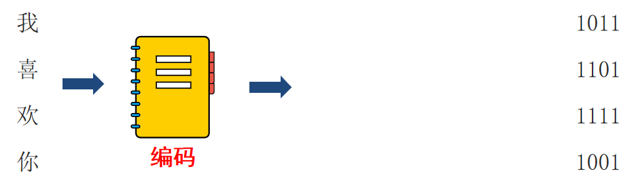
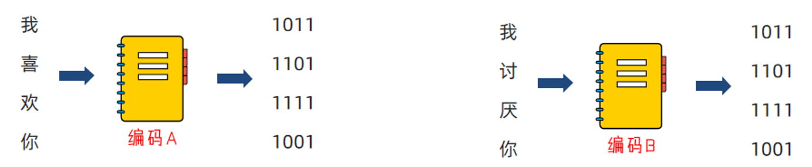
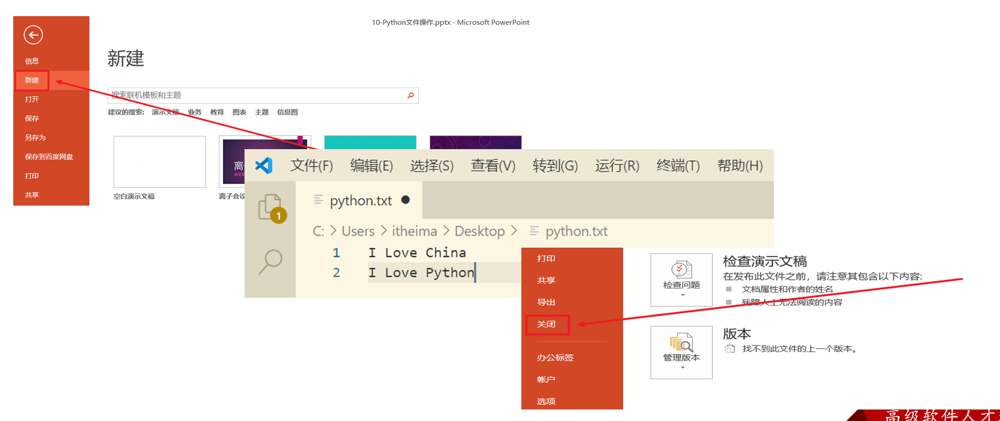

# 第一阶段 - 第八章：Python 文件操作

**目录：**

[TOC]

---

## 一、文件编码概念

### 1.1 文件编码

思考：计算机只能识别 0 和 1，那么我们丰富的文本文件是如何被计算机识别并存储在硬盘中呢？
* 答案：使用编码技术（密码本）将内容翻译成 0 和 1 存入。

编码技术即翻译的规则，记录了如何将内容翻译成二进制以及如何将二进制翻译回可识别内容。如下图所示：


编码就是一种规则集合，记录了内容和二进制间进行相互转换的逻辑。计算机中有许多可用编码，例如 UTF-8、GBK、Big5 等，其中我们最常用的是 UTF-8 编码。不同的编码，将内容翻译成二进制也是不同的。

> 为什么需要使用编码？
> * 计算机只认识 0 和 1，所以需要将内容翻译成 0 和 1 才能保存在计算机中；
> * 同时也需要编码，将计算机保存的 0 和 1，反向翻译回可以识别的内容。

编码有许多，所以要使用正确的编码，才能对文件进行正确的读写操作：

如上图所示，如果你给喜欢的女孩发送文件，使用编码 A 进行编码（内容转二进制），女孩使用编码 B 打开文件进行解码（二进制反转回内容），那只好自求多福了！

### 1.2 查看文件编码

我们可以使用 Windows 系统自带的记事本，打开文件后，即可看出文件的编码是什么：


UTF-8 是目前全球通用的编码格式。

除非有特殊需求，否则一律以 UTF-8 格式进行文件编码即可。

## 二、文件的读取操作

### 2.1 文件及文件操作

内存中存放的数据在计算机关机后就会消失。要想长久保存数据，就要使用硬盘、光盘、U 盘等设备。为了便于数据的管理和检索，引入了“文件”的概念。

一篇文章、一段视频、一个可执行程序，都可以被保存为一个文件，并赋予一个文件名。操作系统以文件为单位管理磁盘中的数据。一般来说，文件可分为文本文件、视频文件、音频文件、图像文件、可执行文件等多种类别。


在日常生活中，文件操作主要包括打开、关闭、读、写等操作：


想想我们平常对文件的基本操作，大概可以分为三个步骤（简称文件操作三步走）：
1. 打开文件；
2. 读写文件；
3. 关闭文件。

> 注意：可以只打开和关闭文件，不进行任何读写。

### 2.2 open() 打开函数

在 Python 中，使用 `open` 函数，可以打开一个已经存在的文件，或者创建一个新文件，语法如下：
```python
open(name, mode, encoding)
```
其中：
* `name`：是要打开的目标文件名的字符串（可以包含文件所在的具体路径）；
* `mode`：设置打开文件的模式（访问模式），包括只读、写入、追加等；
* `encoding`：编码格式（推荐使用 UTF-8）。

> 注意：操作文件需要通过 `open` 函数打开文件得到文件对象。

示例代码：
```python
f = open('python.txt', 'r', encoding='UTF-8')
# encoding 的顺序不是第三位，所以不能用位置参数，应用关键字参数直接指定
```
> 注意：此时的 `f` 是 `open` 函数的文件对象。对象是 Python 中一种特殊的数据类型，拥有属性和方法，可以使用 `对象.属性` 或 `对象.方法` 对其进行访问。后续面向对象课程会给大家进行详细的介绍。

`mode` 常用的三种基础访问模式：
| 模式 | 描述 |
| :--: | :--: |
| `r` | 以只读方式打开文件；文件的指针将会放在文件的开头。这是默认模式。 |
| `w` | 打开一个文件只用于写入。如果该文件已存在则打开文件，并从头开始编辑，原有内容会被删除；如果该文件不存在，则创建新文件。 |
| `a` | 打开一个文件用于追加。如果该文件已存在，新的内容将会被写入到已有内容之后；如果该文件不存在，则创建新文件进行写入。 |

### 2.3 读操作相关方法

`read()` 方法：
* 语法格式：`文件对象.read(num)`。
  * `num` 表示要从文件中读取的数据的长度（单位是字节）；如果没有传入 `num`，那么就表示读取文件中所有的数据。

`readlines()` 方法：
* 方法功能：`readlines` 可以按照行的方式把整个文件中的内容进行一次性读取，并且返回的是一个列表，其中每一行的数据为一个元素。
* 语法格式：
    ```python
    f = open('python.txt')
    content = f.readlines()

    # ['hello world\n', 'abcdefg\n', 'aaa\n', 'bbb\n', 'ccc']
    print(content)

    # 关闭文件
    f.close()
    ```

`readline()` 方法：
* 方法功能：一次读取一行内容。
* 语法格式：
    ```python
    f = open('python.txt')

    content = f.readline()
    print(f'第一行：{content}')

    content = f.readline()
    print(f'第二行：{content}')

    # 关闭文件
    f.close()
    ```

`for` 循环读取文件行：
* 语法格式：
    ```python
    for line in open("python.txt", "r"):
        print(line)

    # 每一个 line 临时变量，就记录了文件的一行数据
    ```

`close()` 关闭文件对象：
* 语法格式：
    ```python
    f = open("python.txt", "r")

    f.close()

    # 最后通过 close，关闭文件对象，也就是关闭对文件的占用
    # 如果不调用 close，同时程序没有停止运行，那么这个文件将一直被 Python 程序占用
    ```
> 注意：文件读取完成后，要使用 `文件对象.close()` 方法关闭文件对象，否则文件会被一直占用。

`with open`：
* 语法格式：
    ```python
    with open("python.txt", "r") as f:
        f.readlines()

    # 通过在 with open 的语句块中对文件进行操作
    # 可以在操作完成后自动关闭（close）文件，避免遗忘掉 close 方法
    ```

### 2.4 操作汇总

文件操作汇总如下表所示：
| 操作 | 功能 |
| :--: | :--: |
| `文件对象 = open(file, mode, encoding)` | 打开文件获得文件对象 |
| `文件对象.read(num)` | 读取指定长度字节，不指定 `num` 则读取文件全部 |
| `文件对象.readline()` | 读取一行 |
| `文件对象.readlines()` | 读取全部行，得到列表 |
| `for line in 文件对象` | `for` 循环文件行，一次循环得到一行数据 |
| `文件对象.close()` | 关闭文件对象 |
| `with open() as f` | 通过 `with open` 语法打开文件，可以自动关闭文件 |

## 三、文件的写入操作

### 3.1 写操作快速入门

写入文件使用 `open` 函数的 `"w"` 模式进行写入。

案例演示：
```python
# 1. 打开文件
f = open('python.txt', 'w')

# 2. 文件写入
f.write('hello world')

# 3. 内容刷新
f.flush()
```

> 注意：
> * 直接调用 `write`，内容并未真正写入文件，而是会积攒在程序的内存中，称之为缓冲区；
> * 当调用 `flush` 的时候，内容会真正写入文件；
> * 这样做是避免频繁的操作硬盘，导致效率下降（攒一堆，一次性写磁盘）。

### 3.2 写操作注意

文件如果不存在，使用 `"w"` 模式，会创建新文件。

文件如果存在，使用 `"w"` 模式，会将原有内容清空。

> 注意：`close()` 方法，带有 `flush()` 方法的功能。

## 四、文件的追加写入操作

### 4.1 追加写入操作快速入门

追加写入文件使用 `open` 函数的 `"a"` 模式进行写入。

案例演示：
```python
# 1. 打开文件，通过 a 模式打开即可
f = open('python.txt', 'a')

# 2. 文件写入
f.write('hello world')

# 3. 内容刷新
f.flush()
```

> 注意：
> * `"a"` 模式，文件不存在会创建文件；
> * `"a"` 模式，文件存在会在最后，追加写入文件。

### 4.2 追加写入操作注意

可以使用 `"\n"` 来写出换行符。

## 五、文件操作综合案例

学习目标：完成文件备份案例。

### 5.1 需求分析

需求：
> 有一份账单文件，记录了消费收入的具体记录，内容如下：
```python
name,date,money,type,remarks
周杰轮,2022-01-01,100000,消费,正式
周杰轮,2022-01-02,300000,收入,正式
周杰轮,2022-01-03,100000,消费,测试
林俊节,2022-01-01,300000,收入,正式
林俊节,2022-01-02,100000,消费,测试
林俊节,2022-01-03,100000,消费,正式
林俊节,2022-01-04,100000,消费,测试
林俊节,2022-01-05,500000,收入,正式
张学油,2022-01-01,100000,消费,正式
张学油,2022-01-02,500000,收入,正式
张学油,2022-01-03,900000,收入,测试
王力鸿,2022-01-01,500000,消费,正式
王力鸿,2022-01-02,300000,消费,测试
王力鸿,2022-01-03,950000,收入,正式
刘德滑,2022-01-01,300000,消费,测试
刘德滑,2022-01-02,100000,消费,正式
刘德滑,2022-01-03,300000,消费,正式

```
> 我们可以将内容复制并保存为 `bill.txt` 文件。

我们现在要做的就是：
* 读取文件；
* 将文件写出到 `bill.txt.bak` 文件作为备份；
* 同时，将文件内标记为测试的数据行丢弃。

### 5.2 实现思路

根据需求分析，案例实现思路如下：
* `open` 和 `"r"` 模式打开一个文件对象，并读取文件；
* `open` 和 `"w"` 模式打开另一个文件对象，用于文件写出；
* `for` 循环内容，判断是否是测试，若不是测试就 `write` 写出，若是测试就 `continue` 跳过；
* 将 2 个文件对象均 `close()`。

### 5.3 具体实现

`文件操作的综合案例.py`：
```python
"""
演示文件操作综合案例：文件备份
"""

# 打开文件得到文件对象，准备读取
fr = open("D:/Learn/Python/src/chapter1.8/bill.txt", "r", encoding="UTF-8")
# 打开文件的得到文件对象，准备写入
fw = open("D:/Learn/Python/src/chapter1.8/bill.txt.bak", "w", encoding="UTF-8")
# for 循环读取文件
for line in fr:
    line = line.strip()
    # 判断内容，将满足的内容写出
    if line.split(",")[4] == "测试":
        continue    # continue 进入下一次循环，这一次后面的内容就跳过了
    # 将内容写出去
    fw.write(line)
    # 由于前面对内容进行了 strip() 的操作，所以要手动的写出换行符
    fw.write("\n")

# close 2 个文件对象
fr.close()
fw.close()  # 写出文件调用 close() 会自动 flush()

```