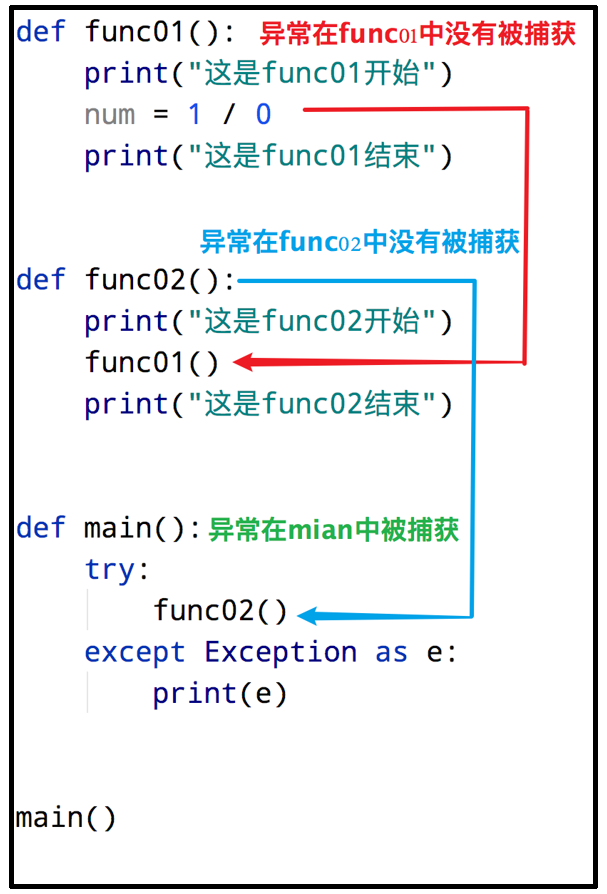
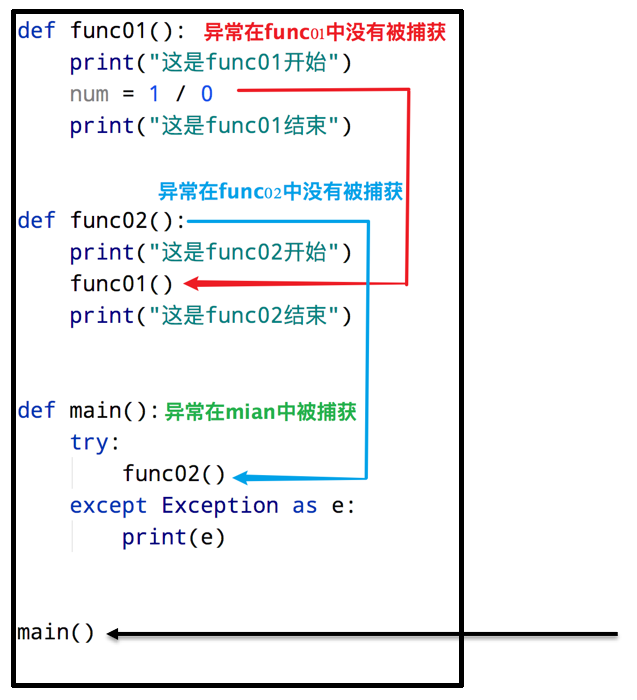

# 第一阶段 - 第九章：Python 异常、模块与包

**目录：**

[TOC]

---

## 一、异常

### 1.1 了解异常

#### 1.1.1 什么是异常

当检测到一个错误时，Python 解释器就无法继续执行了，反而出现了一些错误的提示，这就是所谓的“异常”，也就是我们常说的 BUG（翻译成中文即为“小虫子”的意思）。

> 什么是异常：异常就是程序运行的过程中出现了错误。


#### 1.1.2 bug 单词的诞生

早期计算机采用大量继电器工作，马克二型计算机就是这样的。


1945 年 9 月 9 日，下午三点，马克二型计算机无法正常工作了，技术人员试了很多办法，最后定位到第 70 号继电器出错。负责人哈珀观察这个出错的继电器，发现一只飞蛾躺在中间，已经被继电器打死。她小心地用镊子将蛾子夹出来，用透明胶布贴到“事件记录本”中，并注明“第一个发现虫子的实例”。自此之后，引发软件失效的缺陷，便被称为 Bug。


> bug 是什么意思：bug 就是指异常的意思，因为历史上由于小虫子导致计算机失灵的案例，所以用 bug（小虫子）代替异常的习惯延续至今；bug 就代表软件出现错误。

#### 1.1.3 异常演示

例如，以 `"r"` 方式打开一个不存在的文件：
```python
f = open('linux.txt', 'r')
```

执行结果：


### 1.2 异常的捕获

#### 1.2.1 为什么要捕获异常

世界上没有完美的程序，任何程序在运行的过程中，都有可能出现异常，也就是出现 bug，导致程序无法完美运行下去。

我们要做的，不是力求程序完美运行；而是在力所能及的范围内，对可能出现的 bug，进行提前准备、提前处理。

这种行为我们称之为：异常处理（捕获异常）。

> 为什么要捕获异常？
>
> 在可能发生异常的地方，进行捕获。当异常出现的时候，提供解决方式，而不是任由导致程序无法运行。

#### 1.2.2 为什么需要捕获异常

当我们的程序遇到了 BUG，那么接下来有两种情况：
1. 整个程序因为一个 BUG 停止运行；
2. 对 BUG 进行提醒，整个程序继续运行。

显然在之前的学习中，我们所有的程序遇到 BUG 就会出现 1. 的这种情况，也就是整个程序直接崩溃。但是在真实工作中，我们肯定不能因为一个小的 BUG 就让整个程序全部崩溃，也就是我们希望的是达到 2. 的这种情况。那这里我们就需要使用到捕获异常。

捕获异常的作用在于：提前假设某处会出现异常，做好提前准备，当真的出现异常的时候，可以有后续手段。

#### 1.2.3 捕获异常的语法

捕获异常的基本语法如下：
```python
try:
    可能要发生异常的语句
except [异常 as 别名]:
    出现异常的准备手段
[else:]
    未出现异常时应做的事情
[finally:]
    不管出不出现异常都会做的事情
```

##### 1.2.3.1 捕获常规异常

基本语法：
```python
try:
    可能发生错误的代码
except:
    如果出现异常执行的代码
```

快速入门：
* 需求：尝试以 `"r"` 模式打开文件，如果文件不存在，则以 `"w"` 方式打开。
  * 示例代码：
    ```python
    try:
        f = open('linux.txt', 'r')
    except:
        f = open('linux.txt', 'w')
    ```

##### 1.2.3.2 捕获指定异常

基本语法：
```python
try:
    print(name)
except NameError as e:
    print('name 变量名称未定义错误')
```

> 注意：
> * 如果尝试执行的代码的异常类型和要捕获的异常类型不一致，则无法捕获异常。
> * 一般 `try` 下方只放一行尝试执行的代码。

##### 1.2.3.3 捕获多个异常

当捕获多个异常时，可以把要捕获的异常类型的名字放到 `except` 后，并使用元组的方式进行书写。

基本语法：
```python
try:
    print(1 / 0)
except (NameError, ZeroDivisionError):
    print('ZeroDivision 错误 ...')
```
执行结果：


##### 1.2.3.4 捕获异常并输出描述信息

基本语法：
```python
try:
    print(num)
except (NameError, ZeroDivisionError) as e:
    print(e)
```
执行结果：


##### 1.2.3.5 捕获所有异常

异常的种类多种多样，如果想要不管什么类型的异常都能捕获到，那么使用以下两种方式即可捕获全部的异常：
* `except:`；
* `except Exception:`。

基本语法：
```python
try:
    print(name)
except Exception as e:
    print(e)
```
执行结果：


##### 1.2.3.6 异常 else

`else` 表示的是如果没有异常要执行的代码。

基本语法：
```python
try:
    print(1)
except Exception as e:
    print(e)
else:
    print('我是 else，是没有异常的时候执行的代码')
```
执行结果：


##### 1.2.3.7 异常的 finally

`finally` 表示的是无论是否异常都要执行的代码，例如关闭文件。

基本语法：
```python
try:
    f = open('test.txt', 'r')
except Exception as e:
    f = open('test.txt', 'w')
else:
    print('没有异常，真开心')
finally:
    f.close()
```

### 1.3 异常的传递

异常是具有传递性的。如下图所示：

如上图所示：当函数 `func01` 中发生异常，并且没有捕获处理这个异常的时候，异常会传递到函数 `func02`；当 `func02` 也没有捕获处理这个异常的时候，`main` 函数会捕获到这个异常。这就是异常的传递性。

> 提示：当所有函数都没有捕获异常的时候，程序就会报错。

利用异常具有传递性的特点，当我们想要保证程序不会因为异常崩溃的时候，就可以在 `main` 函数中设置异常捕获；由于无论在整个程序哪里发生异常，最终都会传递到 `main` 函数中，这样就可以确保所有的异常都会被捕获。如下图所示：


## 二、模块

### 2.1 模块的概念和导入

#### 2.1.1 什么是模块

Python 模块（Module），是一个 Python 文件，以 `.py` 结尾。模块能定义函数、类和变量，模块里也能包含可执行的代码。

模块的作用：Python 中有很多各种不同的模块，每一个模块都可以帮助我们快速地实现一些功能，比如实现和时间相关的功能就可以使用 `time` 模块。我们可以认为一个模块就是一个工具包，每一个工具包中都有各种不同的工具供我们使用进而实现各种不同的功能。

> 大白话：模块就是一个 Python 文件，里面有类、函数、变量等，我们可以拿过来用（导入模块去使用）。

#### 2.1.2 模块的导入方式

模块在使用前需要先导入。导入的语法如下：
```python
[from 模块名] import [模块 | 类 | 变量 | 函数 | *] [as 别名]
```

其中 `*` 表示导入模块中的全部内容。

> 注意：在语法中，`[]` 括起来的内容表示可选内容。

常用的组合形式如：
* `import 模块名`；
* `from 模块名 import 类、变量、方法等`；
* `from 模块名 import *`；
* `import 模块名 as 别名`；
* `from 模块名 import 功能名 as 别名`。

> 注意：
> * `from` 可以省略，直接 `import` 即可；
> * `as` 别名可以省略；
> * 通过“`.`”来确定层级关系；
> * 模块的导入一般写在代码文件的开头位置。

##### 2.1.2.1 `import 模块名`

基本语法：
```python
import 模块名
import 模块名 1, 模块名 2

模块名.功能名()
```

案例 - 导入 `time` 模块：
```python
# 导入时间模块
import time

print("开始")
# 让程序睡眠 1 秒（阻塞）
time.sleep(1)
print("结束")
```

> 注意：使用 `import 模块名` 的方式导入模块时，调用模块内的功能的写法为 `模块名.功能名()`。

##### 2.1.2.2 `from 模块名 import 功能名`

基本语法：
```python
from 模块名 import 功能名

功能名()
```

案例 - 导入 `time` 模块中的 `sleep` 方法：
```python
# 导入时间模块中的 sleep 方法
from time import sleep

print("开始")
# 让程序睡眠 1 秒（阻塞）
sleep(1)
print("结束")
```

##### 2.1.2.3 `from 模块名 import *`

基本语法：
```python
from 模块名 import *

功能名()
```

案例 - 导入 `time` 模块中所有的方法：
```python
# 导入时间模块中所有的方法
from time import *

print("开始")
# 让程序睡眠 1 秒（阻塞）
sleep(1)
print("结束")
```

> 注意：`from 模块名 import *` 和前面提到的 `import 模块名` 的功能相同，都是导入模块中的全部内容。区别在于，当使用 `import 模块名` 导入模块时，调用模块内的功能的写法为 `模块名.功能名()`；而当使用 `from 模块名 import *` 导入模块时，调用模块内的功能的写法可以直接写为 `功能名()`。

##### 2.1.2.4 `as` 定义别名

基本语法：
```python
# 模块定义别名
import 模块名 as 别名

# 功能定义别名
from 模块名 import 功能 as 别名
```

案例 1 - 模块别名：
```python
# 模块别名
import time as tt

tt.sleep(2)
print('hello')
```

案例 2 - 功能别名：
```python
# 功能别名
from time import sleep as sl

sl(2)
print('hello')
```