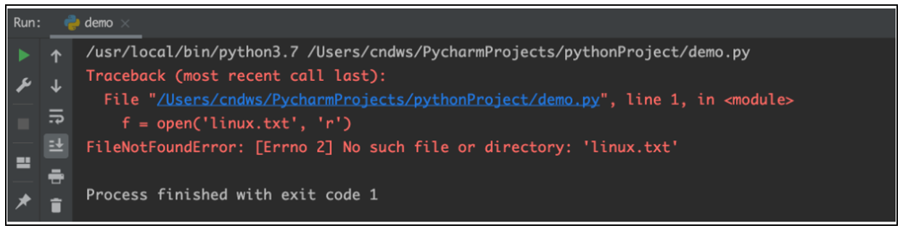
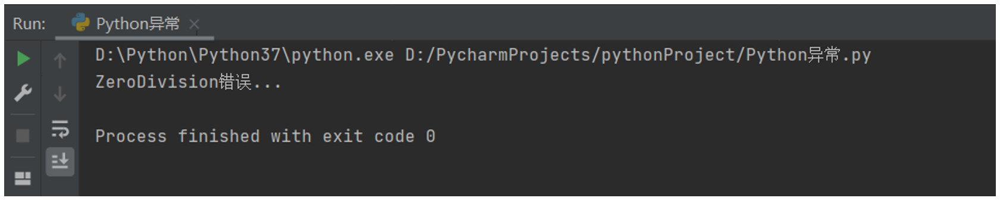
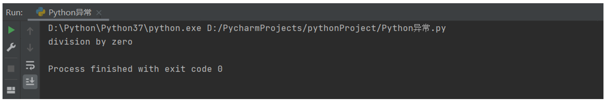
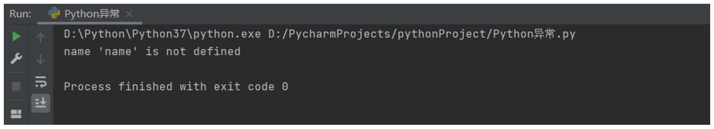

# 第一阶段 - 第九章：Python 异常、模块与包

**目录：**

[TOC]

---

## 一、了解异常

### 1.1 什么是异常

当检测到一个错误时，Python 解释器就无法继续执行了，反而出现了一些错误的提示，这就是所谓的“异常”，也就是我们常说的 BUG（翻译成中文即为“小虫子”的意思）。

> 什么是异常：异常就是程序运行的过程中出现了错误。


### 1.2 bug 单词的诞生

早期计算机采用大量继电器工作，马克二型计算机就是这样的。


1945 年 9 月 9 日，下午三点，马克二型计算机无法正常工作了，技术人员试了很多办法，最后定位到第 70 号继电器出错。负责人哈珀观察这个出错的继电器，发现一只飞蛾躺在中间，已经被继电器打死。她小心地用镊子将蛾子夹出来，用透明胶布贴到“事件记录本”中，并注明“第一个发现虫子的实例”。自此之后，引发软件失效的缺陷，便被称为 Bug。


> bug 是什么意思：bug 就是指异常的意思，因为历史上由于小虫子导致计算机失灵的案例，所以用 bug（小虫子）代替异常的习惯延续至今；bug 就代表软件出现错误。

### 1.3 异常演示

例如，以 `"r"` 方式打开一个不存在的文件：
```python
f = open('linux.txt', 'r')
```

执行结果：


## 二、异常的捕获

### 2.1 为什么要捕获异常

世界上没有完美的程序，任何程序在运行的过程中，都有可能出现异常，也就是出现 bug，导致程序无法完美运行下去。

我们要做的，不是力求程序完美运行；而是在力所能及的范围内，对可能出现的 bug，进行提前准备、提前处理。

这种行为我们称之为：异常处理（捕获异常）。

> 为什么要捕获异常？
>
> 在可能发生异常的地方，进行捕获。当异常出现的时候，提供解决方式，而不是任由导致程序无法运行。

### 2.2 为什么需要捕获异常

当我们的程序遇到了 BUG，那么接下来有两种情况：
1. 整个程序因为一个 BUG 停止运行；
2. 对 BUG 进行提醒，整个程序继续运行。

显然在之前的学习中，我们所有的程序遇到 BUG 就会出现 1. 的这种情况，也就是整个程序直接崩溃。但是在真实工作中，我们肯定不能因为一个小的 BUG 就让整个程序全部崩溃，也就是我们希望的是达到 2. 的这种情况。那这里我们就需要使用到捕获异常。

捕获异常的作用在于：提前假设某处会出现异常，做好提前准备，当真的出现异常的时候，可以有后续手段。

### 2.3 捕获异常的语法

捕获异常的基本语法如下：
```python
try:
    可能要发生异常的语句
except [异常 as 别名]:
    出现异常的准备手段
[else:]
    未出现异常时应做的事情
[finally:]
    不管出不出现异常都会做的事情
```

#### 2.3.1 捕获常规异常

基本语法：
```python
try:
    可能发生错误的代码
except:
    如果出现异常执行的代码
```

快速入门：
* 需求：尝试以 `"r"` 模式打开文件，如果文件不存在，则以 `"w"` 方式打开。
  * 示例代码：
    ```python
    try:
        f = open('linux.txt', 'r')
    except:
        f = open('linux.txt', 'w')
    ```

#### 2.3.2 捕获指定异常

基本语法：
```python
try:
    print(name)
except NameError as e:
    print('name 变量名称未定义错误')
```

> 注意：
> * 如果尝试执行的代码的异常类型和要捕获的异常类型不一致，则无法捕获异常。
> * 一般 `try` 下方只放一行尝试执行的代码。

#### 2.3.3 捕获多个异常

当捕获多个异常时，可以把要捕获的异常类型的名字放到 `except` 后，并使用元组的方式进行书写。

基本语法：
```python
try:
    print(1 / 0)
except (NameError, ZeroDivisionError):
    print('ZeroDivision 错误 ...')
```
执行结果：


#### 2.3.4 捕获异常并输出描述信息

基本语法：
```python
try:
    print(num)
except (NameError, ZeroDivisionError) as e:
    print(e)
```
执行结果：


#### 2.3.5 捕获所有异常

异常的种类多种多样，如果想要不管什么类型的异常都能捕获到，那么使用以下两种方式即可捕获全部的异常：
* `except:`；
* `except Exception:`。

基本语法：
```python
try:
    print(name)
except Exception as e:
    print(e)
```
执行结果：


#### 2.3.6 异常 else

`else` 表示的是如果没有异常要执行的代码。

基本语法：
```python
try:
    print(1)
except Exception as e:
    print(e)
else:
    print('我是 else，是没有异常的时候执行的代码')
```
执行结果：


#### 2.3.7 异常的 finally

`finally` 表示的是无论是否异常都要执行的代码，例如关闭文件。

基本语法：
```python
try:
    f = open('test.txt', 'r')
except Exception as e:
    f = open('test.txt', 'w')
else:
    print('没有异常，真开心')
finally:
    f.close()
```